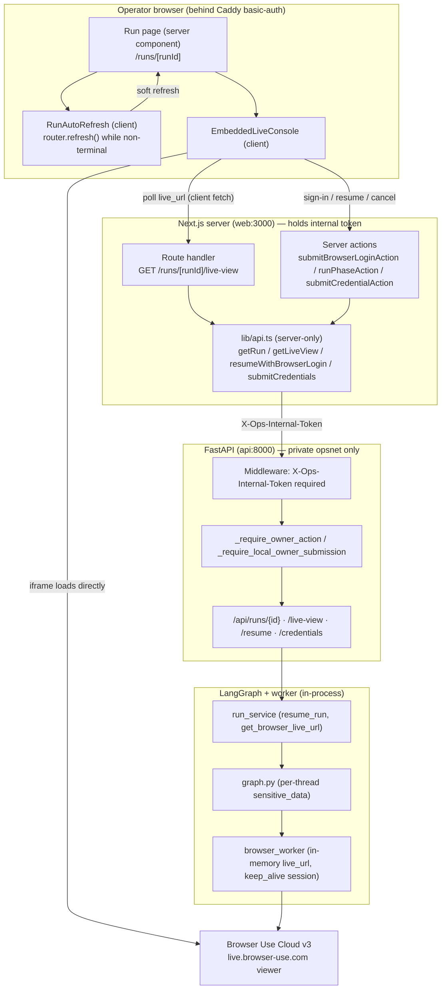
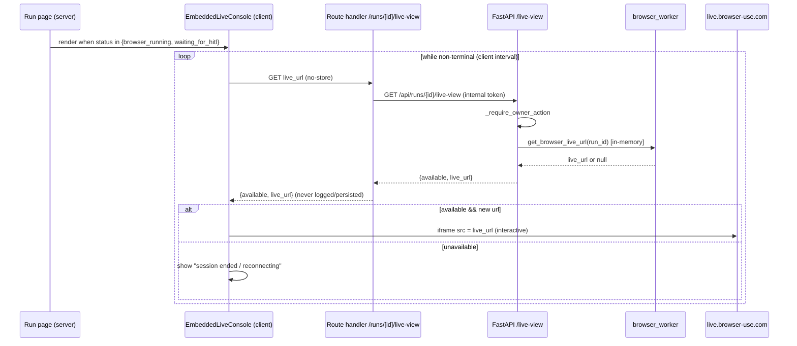

# Design Document: Autonomous Live Browser Console

## Overview

Today the operator can trigger an autonomous developer-onboarding run (Browser Use Cloud v3 + LangGraph),
the agent signs in on its own using credentials the operator supplies through our UI, and the backend
already exposes an owner-only, ephemeral live-view URL. But the live browser opens in a **separate tab**
(the external `live.browser-use.com` viewer), the operator must **click** "Get live browser link" to see
it, and the human-in-the-loop (HITL) prompt, credential entry, and live feed are scattered across the page
and a foreign tab. The operator effectively leaves the run page to do the human part of the work.

This feature makes the run page a **self-contained autonomous console**: the live browser is **embedded
inline** (broadcast feed the operator can click/type into), it **auto-surfaces** whenever a run is
`browser_running` or `waiting_for_hitl`, and the HITL reason + the correct inline control (autonomous
sign-in form for login gates; "I completed it, resume" for CAPTCHA/OTP done inline; cancel) sit right next
to the feed. The operator never leaves the run page.

The backend autonomous-login and live-view contracts already exist on deployed `main` (plus a set of
uncommitted VPS hot-patches). The work here is primarily **frontend embedding + auto-surfacing + coherent
HITL UX**, a small **CSP change**, and a firm **reconciliation of local ↔ deployed source** so the feature
is not built on a divergent base. The single most important open risk is whether the Browser Use viewer can
be framed in our origin; this document treats that as a spike with a concrete fallback and keeps the
recommendation honest.

> Source-of-truth note: the local workspace (branch `fix/live-ten-app-execution`) is **behind** deployed
> `main`. A repository grep for `browser_login` / `sensitive_data` / `reveal_credentials` /
> `resumeWithBrowserLogin` / `login_fields` returns **no matches locally**, yet all of it runs in
> production. The "Verified Deployed State" is authoritative; see the Reconciliation Prerequisite.

---

## Current-State Summary (wired vs. missing)

### What is already wired (verified deployed `main` + hot-patches)

Autonomous login:
- `api/models.py`: `BrowserLoginInput{email: SecretStr, password: SecretStr}`; `ResumeRequest{signal: "completed"|"cancelled" = "completed", browser_login: BrowserLoginInput | None}`.
- `api/app.py` `resume_run` (`POST /api/runs/{id}/resume`): reads payload; when `browser_login` is present, applies the owner gate, then `run_service.resume(browser_login, signal)`.
- `api/service.py`: maps `browser_login` → `{"login_email": ..., "login_password": ...}` → `ops.run_service.resume_run`.
- `ops/run_service.resume_run(browser_login)`: injects raw values as Browser Use `sensitive_data` into `workflow.resume(thread_id, signal, sensitive_data=...)`, then clears them. Never persisted to state / checkpoints / ledger / logs.
- `ops/graph.py`: stores per-thread resume `sensitive_data`, passes it to the browser worker on resume.
- `ops/browser_worker.py` + `api/assignment_runtime.py` (`AssignmentBrowserWorker`): `run_kwargs["sensitive_data"] = dict(...)`; `_render_browser_task(..., login_fields)` **drops** the "entering a password" hard-stop when login creds are present and instructs the agent to type `<secret>login_email</secret>` / `<secret>login_password</secret>` (Browser Use injects the values; the LLM never reads them). CAPTCHA / OTP / MFA / passkey / device / billing / legal still pause for HITL.

Live view:
- `ops/run_service.get_browser_live_url` reads an in-memory signed `live_url` from the worker (kept only in memory, never persisted).
- Exposed at `GET /api/runs/{id}/live-view` → `LiveViewResponse{run_id, available: bool, live_url: str | null}`.

Owner-gate model (deployed):
- Middleware requires `X-Ops-Internal-Token` on **every** `/api/` route. Only the Next.js server-side caller holds it; the browser never does. Caddy basic-auth fronts everything.
- `_require_owner_action(request)`: allows loopback **or** (`ALLOW_LOCAL_CREDENTIAL_SUBMISSION=true` **and** valid internal token). Guards **live-view** and **resume-with-`browser_login`** (these never read stored raw secrets back to the network).
- `_require_local_owner_submission(request)`: loopback-only (+flag). Guards `submit_credentials` (`POST /credentials`) and `reveal_credentials` (`GET /credentials/reveal`, returns raw stored secrets).

Frontend (deployed `main` + VPS-only hot-patches):
- `web/src/app/runs/[runId]/page.tsx` renders `<HitlLiveControls>` when `run.status ∈ {waiting_for_hitl, browser_running}` and not `plan_only`. `<RunAutoRefresh status=...>` soft-refreshes the server component on an interval for non-terminal statuses.
- `web/src/lib/api.ts` has `getLiveView()` and `resumeWithBrowserLogin(runId, email, password)` → `POST /resume {signal:"completed", browser_login:{email,password}}` (180s timeout).
- `web/src/app/runs/[runId]/actions.ts` has `openLiveView`, `submitBrowserLoginAction`, `submitCredentialAction`.
- `web/src/components/hitl-live-controls.tsx` renders a "Get live browser link" button that opens `live_url` in a **new tab**, an autonomous sign-in form, and the API-token credential form.
- Default `execution_mode` is `execute_when_configured`.
- Verified live: execute runs reach `browser_running`/`waiting_for_hitl` with a real Browser Use session; `GET /live-view` returns `200` + `live_url` from the web container path; resume-with-`browser_login` passes the owner gate (`200`) from the web container.

### What is missing (the feature to build)

- **A. Inline embed.** The live browser opens in a new tab (external viewer). It must be embedded in the run page as an interactive broadcast feed (click/type CAPTCHA/OTP inline).
- **B. Auto-surface.** The embed + HITL prompt + inline controls must appear automatically when `status ∈ {browser_running, waiting_for_hitl}` — no manual "Get live browser link" click — and refresh so the page advances as the agent progresses.
- **C. Coherent HITL UX.** Show the live feed + the typed HITL reason (`action_type` / `message`) + the correct inline control: autonomous sign-in form for login gates; a simple "I completed it, resume" for human-only gates done inline; cancel.
- **D. Correct, consistent wiring.** End-to-end contracts (schemas, timeouts, permission/error states) reconciled, with stale copy fixed (e.g., `openLiveView`'s "restricted to the owner on localhost" message).

### Local ↔ deployed divergence (must reconcile first)

| Area | Local `fix/live-ten-app-execution` | Deployed `main` (+ hot-patches) |
|---|---|---|
| `ResumeRequest` | `{signal}` only — **no** `browser_login` | `{signal, browser_login: BrowserLoginInput \| None}` |
| `BrowserLoginInput` | **absent** | `{email: SecretStr, password: SecretStr}` |
| `resume_run` endpoint | takes no payload; `run_service.resume(run_id)` | reads `browser_login`; owner-gated; `resume(browser_login, signal)` |
| `ops/run_service.resume_run` | `(run_id, signal="completed")`, no injection | injects `sensitive_data`, clears after one resume |
| `ops/browser_worker` task | password is a **hard stop**; no `sensitive_data` | drops password hard-stop with `login_fields`; passes `sensitive_data` |
| Owner gate | `_require_owner_live_view` (live-view only) | `_require_owner_action` (live-view **and** resume-with-login) |
| Reveal endpoint | **absent** | `GET /credentials/reveal` (loopback-only) |
| `web/src/lib/api.ts` | `getLiveView`, no `resumeWithBrowserLogin` | + `resumeWithBrowserLogin` (180s) |
| `actions.ts` | no `submitBrowserLoginAction` | + `submitBrowserLoginAction` |
| `hitl-live-controls.tsx` | live link + credential form (no sign-in form) | + autonomous sign-in form |
| Default `execution_mode` | `plan_only` | `execute_when_configured` |

---

## Goals and Non-Goals

### Goals
1. Embed the Browser Use live browser **inline** in the run page as an interactive feed the operator can click and type into (CAPTCHA/OTP/passkey/device approval handled in place).
2. **Auto-surface** the embed, the typed HITL reason, and the correct inline control when `status ∈ {browser_running, waiting_for_hitl}`; auto-advance the page as the agent progresses.
3. Keep sign-in **autonomous**: the operator hands credentials to the agent through our UI (injected as Browser Use `sensitive_data`); the operator does not type the password into the live browser.
4. Make the whole backend↔frontend path (live feed, HITL prompt, resume, credential submission, status refresh) correct, consistent, and **verifiable** on the real backend.
5. Trigger HITL **only** for genuinely human-only gates (CAPTCHA, OTP/2FA, passkey, device approval, billing, legal consent); everything else stays autonomous.
6. Preserve every security invariant: no raw credential / signed-URL leakage across any durable boundary.

### Non-Goals
- CAPTCHA solving or bypass; OTP/TOTP interception or auto-generation (no Browser Use automatic TOTP).
- Multi-tenant access; per-tenant isolation, RBAC, or sharing the live feed with non-owners.
- Building bespoke streaming infrastructure **if** the vendor iframe works (the CDP-screencast path is a fallback, not a goal).
- A "reveal secret" surface in the console; raw-secret readback stays loopback-only and out of the deployed UI.
- Changing the autonomous agent's navigation logic, routing, or the IntegratorBundle contract.

---

## The Embedding Decision (pivotal risk)

Whether the run page can host the live browser **inline** depends on two independent framing gates:

1. **Our page's CSP `frame-src`.** `web/next.config.ts` currently sets `default-src 'self'` and **no** `frame-src`, so `frame-src` falls back to `'self'` and an iframe to `live.browser-use.com` is **blocked today**. This is fully under our control.
2. **The viewer's own response headers.** If `live.browser-use.com` sends `X-Frame-Options: DENY/SAMEORIGIN` or `Content-Security-Policy: frame-ancestors` excluding our origin, the browser refuses to render it in our iframe regardless of our CSP. This is **not** under our control and is the pivotal unknown.

### Evidence

The Browser Use documentation ([Live preview & recording](https://docs.browser-use.com/cloud/browser/live-preview)) explicitly documents embedding the live browser in your app for human interaction, notes the live URL is hosted on `live.browser-use.com`, and instructs adding that host to your CSP `frame-src` directive. It also documents `theme` and `ui` (hide browser chrome) query parameters on the live URL. There is a companion tutorial for building a chat UI with a live browser preview. (Content rephrased for compliance with licensing restrictions.)

That the vendor tells integrators to add `live.browser-use.com` to `frame-src` strongly implies the viewer does **not** send a blocking `X-Frame-Options` / `frame-ancestors` — otherwise the instruction would be moot. This substantially de-risks gate (2), but does not eliminate it: vendor headers can differ by plan/session type and can change, so we still verify empirically against our own account before committing.

### Recommendation: iframe first, with a mandatory spike and a defined fallback

**Primary approach — `<iframe src={live_url}>`.** Lowest complexity, matches the vendor's documented pattern, and the viewer already handles pointer/keyboard interaction, so we do **not** build input forwarding. The only platform change is one CSP line.

**Spike (go/no-go, must run before implementation).** This is a gated live check (`RUN_LIVE_TESTS=1` + `ALLOW_LIVE_BROWSER` + explicit authorization, per AGENTS.md):
1. Start a real session; obtain a `live_url`.
2. Load it in a throwaway page served with our **exact** production CSP (including `frame-src 'self' https://live.browser-use.com`) behind Caddy.
3. Confirm the frame **renders** and **accepts input** (type into a field inside the frame).
4. Capture the viewer's response headers once (`X-Frame-Options`, `Content-Security-Policy: frame-ancestors`) and record them in the spike notes.
5. Confirm behavior across the browsers we support.

**Fallback ladder (only if the frame is refused):**
- **(a) Same-origin reverse-proxy embed.** Proxy `live.browser-use.com` through Caddy under our origin so the frame is same-origin. Higher risk: the viewer likely uses absolute origins / WebSocket upgrades / auth that resist naive proxying; treat as a spike of its own, not a guaranteed fix.
- **(b) CDP screencast (separate raw-browser path).** `client.browsers.create` → `cdp_url` → Playwright/CDP `Page.startScreencast`, stream frames to our UI over a **same-origin** WebSocket (Caddy-proxied so `connect-src 'self'` stays intact; `img-src` already allows `blob:`/`data:`), and forward pointer/keyboard events back over the socket. This is the heaviest option (new server component, input mapping, backpressure) and reuses the existing `run_trusted_raw_browser` boundary rather than a parallel worker.
- **(c) Degraded in-page panel.** A prominent, always-open in-page panel/popup that surfaces the (still owner-only) `live_url` without leaving the run page. Not truly embedded, but keeps the HITL flow and copy coherent as a last resort.

The design proceeds assuming **iframe works** (strongly indicated), while keeping the CDP-screencast fallback documented so a "no" from the spike does not reset the effort.

---

## Architecture



Key architectural choices:
- The **embed's `live_url` is fetched client-side** (route handler → `getLiveView`) and lives only in ephemeral React state. It is **never** placed into the server-rendered HTML / RSC payload, so it cannot land in any cached response.
- The **iframe is isolated in a client component** with a stable `src`, so `RunAutoRefresh`'s `router.refresh()` (server re-render) does not remount/reload the frame and interrupt the operator.
- We **extend** existing abstractions (the live-view endpoint, `_require_owner_action`, `resumeWithBrowserLogin`, `HitlLiveControls`) rather than adding parallel routers/gates/workers, per AGENTS.md.

---

## Data-Flow Diagrams

### (i) Autonomous login

```mermaid
sequenceDiagram
    actor Op as Operator
    participant UI as Run page (EmbeddedLiveConsole)
    participant SA as Server action (submitBrowserLoginAction)
    participant API as FastAPI /resume
    participant RS as run_service.resume_run
    participant BW as browser_worker (same session)
    participant BUC as Browser Use viewer

    Note over UI,BUC: Run is waiting_for_hitl on a sign-in gate (agent paused before password)
    UI->>UI: Auto-show HITL reason + sign-in form
    Op->>UI: Enter account email + password (type=password, autocomplete off)
    UI->>SA: submitBrowserLoginAction(runId, email, password)
    SA->>API: POST /resume {signal:"completed", browser_login:{email,password}} (180s)
    API->>API: _require_owner_action (loopback OR internal token + flag)
    API->>RS: resume(browser_login, signal)
    RS->>BW: workflow.resume(thread_id, signal, sensitive_data={login_email, login_password})
    Note over RS: sensitive_data cleared after one resume; never persisted/logged
    BW->>BUC: Re-render task WITHOUT password hard-stop; type <secret>login_email</secret>/<secret>login_password</secret>
    BUC-->>Op: Operator watches sign-in happen live in the embed
    API-->>UI: ActionReceipt; page auto-refresh advances status
```

### (ii) Embedded live view during `browser_running` / `waiting_for_hitl`



### (iii) Resume (human-only gate completed inline)

```mermaid
sequenceDiagram
    actor Op as Operator
    participant ELC as EmbeddedLiveConsole
    participant BUC as Embedded live browser
    participant SA as Server action (runPhaseAction "resume")
    participant API as FastAPI /resume
    participant RS as run_service.resume_run
    participant BW as browser_worker (same session_id)

    Note over ELC: waiting_for_hitl, action_type ∈ {captcha,email_otp,passkey,device_approval,billing,legal_acceptance}
    Op->>BUC: Solve CAPTCHA / enter OTP / approve device INSIDE the embed
    Op->>ELC: Click "I completed it — resume"
    ELC->>SA: runPhaseAction(resume)
    SA->>API: POST /resume {signal:"completed"} (no browser_login, 180s)
    API->>RS: resume(signal) on SAME thread_id
    RS->>BW: workflow.resume(thread_id, "completed")  (reuses same session_id)
    BW-->>API: next observation (still blocked -> waiting_for_hitl; else browser_running)
    API-->>ELC: ActionReceipt; auto-refresh reflects new status; embed stays on same session
```

---

## Components and Interfaces

### Backend (extend existing; no new routers/gates/workers)

- `GET /api/runs/{id}/live-view` → `LiveViewResponse` — unchanged behavior; `_require_owner_action`.
- `POST /api/runs/{id}/resume` → `ActionReceipt` — `ResumeRequest{signal, browser_login?}`; owner-gated when `browser_login` present.
- `POST /api/runs/{id}/credentials` → `RunDetailResponse` — unchanged; `_require_local_owner_submission` (loopback-only).
- Gate consolidation: land the deployed `_require_owner_action` name (superseding local `_require_owner_live_view`) covering both live-view and resume-with-`browser_login`.

### Frontend (Next.js)

**`web/src/lib/api.ts` (server-only)** — reconcile to deployed set:
```typescript
export function getLiveView(runId: string): Promise<LiveViewResponse>            // GET /live-view
export function resumeWithBrowserLogin(                                          // POST /resume + browser_login, 180s
  runId: string, email: string, password: string,
): Promise<ActionReceipt>
export function performPhaseAction(runId: string, action: "resume" | ...): Promise<ActionReceipt> // resume/cancel, 180s
export function submitCredentials(runId: string, creds: Record<string,string>, company: CompanyProfileInput): Promise<RunDetailResponse>
```

**`web/src/app/runs/[runId]/live-view/route.ts` (NEW route handler)** — client-pollable live_url source:
```typescript
// GET /runs/[runId]/live-view  (same-origin, behind Caddy basic-auth; Next server injects internal token)
// Returns { available: boolean, live_url: string | null }. Cache-Control: no-store. Never logs live_url.
export async function GET(_req: Request, ctx: { params: Promise<{ runId: string }> }): Promise<Response>
```
Rationale: a route handler polls more cleanly than a server action on an interval. (Alternative: keep `openLiveView` as a server action invoked on mount+interval — acceptable, but the route handler is the cleaner data source for the client component.)

**`web/src/components/embedded-live-console.tsx` (NEW client component)** — the core of the feature:
```typescript
export function EmbeddedLiveConsole(props: {
  runId: string
  status: RunStatus                 // browser_running | waiting_for_hitl
  hitl: HitlRequestView | null      // action_type, message, expected_completion_signal, resumable
  credentialField?: { name: string; label: string }
}): JSX.Element
```
Responsibilities:
- On mount and on an interval (while non-terminal), fetch `live_url` from the route handler; keep it only in React state.
- Render `<iframe src={liveUrl}>` with a **stable** `src` (update only when the URL actually changes) so server refreshes don't reload it.
- Render the HITL reason (`action_type` + `message`) and the **inline control set** selected by `action_type` (see layout section).
- Show reconnect/degraded UI when `available === false`.

**`web/src/app/runs/[runId]/actions.ts`** — reconcile to deployed set (`openLiveView`, `submitBrowserLoginAction`, `runPhaseAction`, `submitCredentialAction`); fix stale copy (`openLiveView`'s "restricted to the owner on localhost" → owner-only wording, since the deployed gate also allows the internal-token web caller).

**`web/src/app/runs/[runId]/page.tsx`** — replace the manual `<HitlLiveControls>` mount with `<EmbeddedLiveConsole>` for `status ∈ {browser_running, waiting_for_hitl}` and keep `<RunAutoRefresh>`.

---

## Backend ↔ Frontend Contract

All `/api/` calls carry `X-Ops-Internal-Token` (set only by the Next.js server). Caddy basic-auth fronts the public origin. Timeouts below are the client (Next → FastAPI) bounds.

| Endpoint | Method | Request body | Response | Owner gate | Timeout |
|---|---|---|---|---|---|
| `/api/runs/{id}` | GET | — | `RunDetailResponse` (incl. `hitl_request`) | token only | 8s |
| `/api/runs/{id}/live-view` | GET | — | `LiveViewResponse{available, live_url?}` | `_require_owner_action` | 8s |
| `/api/runs/{id}/resume` (sign-in) | POST | `{signal:"completed", browser_login:{email,password}}` | `ActionReceipt` | `_require_owner_action` | 180s |
| `/api/runs/{id}/resume` (human gate) | POST | `{signal:"completed"}` | `ActionReceipt` | token only | 180s |
| `/api/runs/{id}/resume` (cancel) | POST | `{signal:"cancelled"}` | `ActionReceipt` | token only | 180s |
| `/api/runs/{id}/credentials` | POST | `{company, credentials}` | `RunDetailResponse` | `_require_local_owner_submission` (loopback-only) | 30s |

Same-origin browser → Next paths added/confirmed by this feature:
- `GET /runs/{id}/live-view` (route handler) → `{available, live_url?}`, `no-store`, never logged.
- Server actions: `submitBrowserLoginAction`, `runPhaseAction("resume")`, `submitCredentialAction`.

Notes:
- Resume drives a **synchronous** live browser task; the 180s client bound already exists in `api.ts` for `resume`/`createRun` and must be preserved for `resumeWithBrowserLogin`.
- `ResumeRequest` uses `extra="forbid"`; posting `{}` remains valid (both fields optional/defaulted), so the human-gate/cancel resume payloads are compatible with both local and deployed models.

---

## Frontend Run-Page Layout

When `status ∈ {browser_running, waiting_for_hitl}` and not `plan_only`, the "Browser onboarding" surface renders `<EmbeddedLiveConsole>`:

```
┌─ Autonomous live console ─────────────────────────────────────────┐
│  [status badge]  browser_running / waiting_for_hitl                │
│                                                                    │
│  ┌── Embedded live browser (iframe: live.browser-use.com) ──────┐  │
│  │                                                              │  │
│  │   Interactive feed — operator clicks/types CAPTCHA/OTP here  │  │
│  │                                                              │  │
│  └──────────────────────────────────────────────────────────────┘ │
│  (if unavailable) "Live session ended / reconnecting…"             │
│                                                                    │
│  ── HITL prompt (only when waiting_for_hitl) ──                    │
│  action_type: <human_action_type>                                  │
│  message:     <human_instruction>                                  │
│                                                                    │
│  ── Inline control (selected by action_type) ──                    │
│  [ autonomous sign-in form ]  OR  [ "I completed it — resume" ]    │
│  [ Cancel run ]                                                    │
└────────────────────────────────────────────────────────────────────┘
```

### Auto-surface & auto-refresh
- `EmbeddedLiveConsole` renders automatically from server state (no button). It begins polling `live_url` on mount.
- `RunAutoRefresh` continues to soft-refresh the server component (~2.5s) so `run.status` and `hitl_request` stay current and the page advances (e.g., `waiting_for_hitl` → `browser_running` → credential page / `completed`).
- The iframe is inside the client component with a stable `src`; server refreshes reconcile without tearing it down.

### Inline control selection by `action_type`

`HumanActionType` = `captcha | email_otp | phone_otp | passkey | security_key | device_approval | provider_verification | legal_acceptance | billing | account_selection`.

| `action_type` | Meaning | Primary inline control |
|---|---|---|
| `provider_verification`, `account_selection` | Login / account gate (password prompt classifies here) | **Autonomous sign-in form** (email + password) → `submitBrowserLoginAction` |
| `captcha`, `email_otp`, `phone_otp`, `passkey`, `security_key`, `device_approval`, `legal_acceptance`, `billing` | Genuinely human-only, done **inside the embed** | **"I completed it — resume"** → `runPhaseAction("resume")` |
| any | Abort | **Cancel run** → resume `signal:"cancelled"` (→ `blocked`) |

Known coarseness (call out in UI copy): the worker classifies a bare "enter your password" reason as `provider_verification` (there is no dedicated `login` type), so the sign-in form is offered for `provider_verification`/`account_selection`, and the operator reads the `message` to confirm. "I completed it — resume" is always available as a secondary control.

---

## CSP / Framing Plan

### Exact change (iframe approach)
In `web/next.config.ts`, add one directive to the CSP array:
```typescript
// add to contentSecurityPolicy[]:
"frame-src 'self' https://live.browser-use.com",
```
Result (unchanged directives elided): `default-src 'self'; … ; frame-src 'self' https://live.browser-use.com; frame-ancestors 'none'; …`.

### Blast radius (minimal)
- `frame-src` governs only what **our** pages may embed. Adding exactly one host permits the Browser Use viewer and nothing else.
- `frame-ancestors 'none'` (who may frame **us**) is **unchanged** — our pages remain unembeddable.
- `X-Frame-Options: DENY` (our response header) is **unchanged** and is unrelated to embedding others; leave it as is.
- `connect-src 'self'`, `script-src`, `img-src`, etc. are **unchanged** for the iframe approach: the frame's own network traffic runs under the `live.browser-use.com` context, not ours.
- Optional: append `?ui=false` and/or `?theme=dark` to the `live_url` to hide vendor chrome / match theme (cosmetic).

### If the CDP-screencast fallback is used instead
- Prefer a **same-origin** WebSocket proxied by Caddy so `connect-src 'self'` stays intact; `img-src 'self' blob: data:` already covers screencast frames. Only if we stream directly to a `wss://*.browser-use.com` endpoint would we widen `connect-src` — avoid if possible.

### Caddy and the API CSP (no changes needed; stated to prevent mis-fixes)
- `deploy/Caddyfile` sets no CSP/frame headers on the web route; the Next.js headers pass through. **No Caddy change** is required for the iframe approach.
- FastAPI's strict CSP (`default-src 'none'; frame-ancestors 'none'`) and its `X-Frame-Options: DENY` apply to **API responses**, which are consumed server-side and are **not** publicly proxied. They do **not** affect framing `live.browser-use.com` and must **not** be "relaxed" for this feature.

---

## live_url Lifecycle Handling

Properties of the URL: signed, owner-only, **ephemeral** (Browser Use: ~15-min inactivity timeout, ~4-hour max session), held **only in worker memory** (`browser_worker._live_urls[session_id]`), **never persisted** to state / checkpoints / ledger / logs / git.

- **Acquire:** the client component fetches `live_url` from the route handler → `getLiveView` → `get_browser_live_url` (in-memory). The URL enters the browser only as the iframe `src` and ephemeral React state.
- **Refresh:** poll on an interval while non-terminal. Re-fetch keeps the URL fresh and reconnects after transient unavailability. Update the iframe `src` only when the value actually changes (avoid needless reloads).
- **Expire / unavailable:** when the worker has no session (task finished, `_safe_stop` popped it, or timeout), `/live-view` returns `available:false` → the console shows "session ended / reconnecting" and stops framing. `RunAutoRefresh` then advances the page to the next status.
- **Keep-alive across HITL:** the worker creates the session with `keep_alive=True`; on `hitl_required` it does **not** stop the session, so the same `session_id` (and thus the same `live_url`) persists across the pause. Resume reuses the same `thread_id` → same `session_id`, so the embedded feed stays pointed at the **same live session** before and after resume. (After a non-HITL task completes, `_safe_stop` reclaims the session; that transition is expected and surfaces as `available:false`.)
- **No persistence guarantees:** the route handler and server action set `no-store` and must never log the URL; the client must never write it to `localStorage`/`sessionStorage`; it must not be embedded into SSR/RSC HTML.

---

## Data Models

```python
# api/models.py (deployed contract to land in repo)
class BrowserLoginInput(StrictApiModel):
    email: SecretStr
    password: SecretStr

class ResumeRequest(StrictApiModel):
    signal: Literal["completed", "cancelled"] = "completed"
    browser_login: BrowserLoginInput | None = None

class LiveViewResponse(StrictApiModel):
    run_id: str
    available: bool
    live_url: str | None = None      # never persisted; read live from the in-memory worker

class HitlRequestView(StrictApiModel):
    action_type: str                 # HumanActionType
    message: str
    expected_completion_signal: str
    resumable: bool
```

```typescript
// web/src/lib/types.ts (frontend mirrors)
type RunStatus = "created" | "researching" | "route_selected" | "browser_running"
  | "waiting_for_hitl" | "outreach_sent" | "waiting_for_reply"
  | "credentials_ready" | "blocked" | "failed" | "completed"

interface LiveViewResponse { run_id: string; available: boolean; live_url: string | null }
interface HitlRequestView { action_type: string; message: string; expected_completion_signal: string; resumable: boolean }
```

Validation rules:
- `browser_login` values are `SecretStr`; injected once as `sensitive_data`, cleared after one resume, never serialized.
- `live_url` is validated as an HTTPS URL on the frame side only; the backend does not persist it.

---

## Error Handling

| Scenario | Condition | Response | Recovery |
|---|---|---|---|
| No live session | `/live-view` → `available:false` | Console shows "session ended / reconnecting"; no iframe | Keep polling; `RunAutoRefresh` advances status |
| Frame refused | Viewer sends blocking `X-Frame-Options`/`frame-ancestors` | Detect load failure; show degraded panel with owner-only link | Trigger fallback ladder (proxy / CDP screencast / panel) |
| Owner gate 403 | Missing token/flag/loopback | `openLiveView`/sign-in action shows owner-only message (fixed copy) | Operator/deploy fixes `ALLOW_LOCAL_CREDENTIAL_SUBMISSION` / token |
| Sign-in rejected | Resume with `browser_login` fails or re-interrupts | `waiting_for_hitl` with refreshed reason | Re-enter credentials or complete the new gate inline |
| Resume conflict | Run not in `waiting_for_hitl` (409) | "This run is not waiting for a sign-in right now" | Auto-refresh reconciles state |
| Resume timeout | Live task exceeds 180s | Action surfaces a timeout error; run state unchanged server-side | Retry after next observation; do not double-submit |
| Session expired mid-HITL | 15-min inactivity / 4-hour max elapsed | `available:false`; resume may fail | Surface expiry; operator restarts the run if needed |

---

## Security Considerations

- **The embed does not create a new exposure.** The signed `live_url` already reaches the browser DOM today (as the "Open live session" anchor `href`). Putting it in an iframe `src` is the **same** already-sanctioned ephemeral exposure at the live-view endpoint. No new durable boundary is crossed.
- **No persistence of the signed URL.** Client-side fetch only; `no-store`; no `localStorage`/`sessionStorage`; no client or server logging of the URL; not embedded into SSR/RSC HTML; not committed. (Matches AGENTS.md: signed live links must not cross a durable boundary.)
- **Autonomous-login credentials** are injected as Browser Use `sensitive_data` so the LLM never reads values; discarded after one resume; never persisted to state/checkpoints/ledger/logs. The sign-in form uses `type=password`, `autocomplete=off`, and clears the field from the DOM after handoff (as the existing credential form does).
- **Owner gates unchanged.** live-view and resume-with-`browser_login` use `_require_owner_action` (loopback OR internal token + `ALLOW_LOCAL_CREDENTIAL_SUBMISSION`), justified because neither reads stored raw secrets back to the network. `submit_credentials` and `reveal_credentials` stay **loopback-only**; the deployed web console never calls reveal.
- **Minimal CSP relaxation.** Exactly one host added to `frame-src`; `frame-ancestors 'none'` and `X-Frame-Options: DENY` on our pages are unchanged, so our own pages remain unframeable.
- **Same session across HITL.** Reusing `session_id`/`thread_id` avoids spawning extra sessions (cost + surface) and keeps the operator on one verified live view.
- **Extend, don't fork.** Reuse the existing live-view endpoint, `_require_owner_action`, `resumeWithBrowserLogin`, `HitlLiveControls`, and the existing `run_trusted_raw_browser` boundary (for the CDP fallback) instead of parallel routers/gates/workers.

---

## Local ↔ Deployed Reconciliation Prerequisite

This feature must **not** be built on the divergent local base. Before any embedding work:

1. **Single source of truth.** Diff the VPS working tree against the repo and land the deployed hot-patches as reviewed commits on `main`: `BrowserLoginInput` + `ResumeRequest.browser_login`; resume `browser_login` handling + owner gate; `ops/run_service.resume_run` `sensitive_data` inject/clear; `ops/graph.py` per-thread `sensitive_data`; `browser_worker`/`AssignmentBrowserWorker` `sensitive_data` + `login_fields` task rendering; `_require_owner_action` (superseding `_require_owner_live_view`); the loopback-only `reveal` endpoint; frontend `resumeWithBrowserLogin`, `submitBrowserLoginAction`, the sign-in form, and the `execute_when_configured` default. Ensure no secret/`live_url` is committed in the process.
2. **Bring the local workspace onto `main`.** Rebase/merge `fix/live-ten-app-execution` onto the reconciled `main` (or branch fresh from it).
3. **Verify local == deployed before implementation.** Run the offline-safe suite (`ruff`, `mypy`, `pytest`) plus a **gated** live smoke (`RUN_LIVE_TESTS=1` + `ALLOW_LIVE_BROWSER` + explicit authorization) to confirm parity: execute run reaches `browser_running`/`waiting_for_hitl`; `GET /live-view` → `200` + `live_url`; resume-with-`browser_login` passes the owner gate (`200`).

Only after parity is confirmed does the embedding work begin.

---

## Correctness Properties

*A property is a characteristic that should hold across all valid executions. These are the invariants this feature must preserve. Each property references the requirements (`requirements.md`) it validates.*

### Property 1: Signed live URL is never persisted
For any run and any sequence of live-view fetches, the signed `live_url` never appears in run state, checkpoints, the audit ledger, server or client logs, client-persistent storage, or SSR/RSC HTML — it exists only in worker memory and ephemeral client state.

**Validates: Requirements 8.1, 8.2, 8.3, 8.6, 10.1**

### Property 2: Autonomous-login credentials are never persisted or read by the LLM
For any `resume` carrying `browser_login`, the raw email/password are injected as `sensitive_data` and cleared after exactly one resume; they never enter state, checkpoints, ledger, logs, or the LLM-visible task text.

**Validates: Requirements 3.2, 3.3, 3.4, 10.2**

### Property 3: Same session across HITL
For any run that pauses at `waiting_for_hitl` and is resumed, the resumed task reuses the same `session_id`/`thread_id`, so the embedded feed points at the same live session before and after resume (no new session is created).

**Validates: Requirements 8.4, 8.5**

### Property 4: Auto-surface matches backend state
For any run with `status ∈ {browser_running, waiting_for_hitl}` and not `plan_only`, the embedded console renders without operator action; for any terminal status, it stops polling and unframes.

**Validates: Requirements 1.1, 2.1, 2.3, 2.5**

### Property 5: Inline control matches the gate
For any `waiting_for_hitl` observation, the control offered is the autonomous sign-in form iff `action_type ∈ {provider_verification, account_selection}`, and a plain resume otherwise; cancel is always available.

**Validates: Requirements 5.1, 5.2, 5.3**

### Property 6: Minimal framing relaxation
The page CSP permits framing exactly `'self'` and `https://live.browser-use.com` and no other host, and `frame-ancestors 'none'` remains in effect.

**Validates: Requirements 9.1, 9.2**

---

## Testing & Verification Strategy

Per AGENTS.md: normal tests are offline-safe; live provider actions require explicit authorization + `RUN_LIVE_TESTS=1` + provider safety flags. A feature is complete only when integrated through the public API, covered by tests, and truthfully represented in the frontend.

### Offline-safe (default CI)
- **Backend unit:** `ResumeRequest` accepts/forbids fields (`extra="forbid"`); `browser_login` maps to `login_email`/`login_password`; `sensitive_data` injected then cleared (assert absent from state/checkpoints/ledger/logs); `_require_owner_action` returns `200` for loopback/internal-token and `403` otherwise; `live_url` never written to storage; resume reuses `session_id` (mock worker).
- **Frontend unit (mocked fetch):** `api.ts` `resumeWithBrowserLogin` payload shape + 180s bound; `LiveViewResponse` schema parse; `EmbeddedLiveConsole` renders the iframe when `available`, shows reconnect when not, and picks the correct control by `action_type`; iframe `src` is stable across `router.refresh()` (no remount); assert `next.config.ts` CSP contains `frame-src … https://live.browser-use.com` and still contains `frame-ancestors 'none'`.
- **Copy/regression:** stale `openLiveView` message replaced; secret-scan (`detect-secrets`, `git grep`) shows no committed `live_url`/credentials.

### Gated live (explicit authorization required)
- **Iframe-embeddability spike (go/no-go):** cannot be proven offline. Start a real session, load `live_url` under our exact production CSP behind Caddy, confirm the frame renders and accepts input, and record the viewer's `X-Frame-Options`/`frame-ancestors` headers. Decides iframe vs. fallback.
- **Wiring-correctness proof on the real backend:** extend the existing gated live-smoke harness (`scripts/live_smoke.py`) to: create an `execute` run; wait for `browser_running`/`waiting_for_hitl`; assert `GET /live-view` → `200` + `live_url` via the web-container path; assert `POST /resume` with `browser_login` passes the owner gate (`200`); assert the status advances. This reproduces the "verified live" evidence and proves the end-to-end path is coherent.

### Manual acceptance (documented, not automated)
- With the embed live, complete a real human gate (e.g., OTP) inside the frame, click "I completed it — resume", and confirm the agent continues in the same session without a new tab.

---

## Dependencies

- **Browser Use Cloud v3** (`browser-use-sdk==3.10.0`): live view hosted at `live.browser-use.com`; `keep_alive` sessions; `sensitive_data` injection; `browsers.create`/`cdp_url` (fallback only). Provider flags: `ALLOW_LIVE_BROWSER=true`, `BROWSER_USE_API_KEY`.
- **LangGraph** (`langgraph==1.2.9`, sqlite checkpointer): durable thread, interrupt/resume, encrypted checkpoints (`LANGGRAPH_AES_KEY`).
- **Next.js** app router (client components, route handler, server actions), `web/next.config.ts` CSP.
- **Caddy** reverse proxy (basic-auth, header pass-through); **FastAPI** (`X-Ops-Internal-Token` middleware, owner gates).
- Env: `ALLOW_LOCAL_CREDENTIAL_SUBMISSION=true`, `OPS_API_URL=http://api:8000`, `SECRET_VAULT_KEY`, `COMPOSIO_API_KEY`.

---

## Open Questions / Risks

1. **Pivotal:** does `live.browser-use.com` allow framing from our origin in our plan/session type? Strongly indicated yes by vendor docs, but confirmed only by the spike. If no, the fallback ladder adds significant effort (esp. CDP screencast).
2. **iframe sandbox:** determine the minimal `sandbox`/`allow` attributes that keep the frame interactive without over-permissioning (spike detail).
3. **Refresh vs. interaction:** confirm `router.refresh()` (2.5s) never interrupts an in-progress interaction in the frame; if it does, gate refresh or isolate further.
4. **`action_type` coarseness:** password gates classify as `provider_verification`; confirm the control mapping + copy are clear enough, or enrich classification later.
5. **Session expiry UX:** define exact behavior when the 15-min/4-hour limits elapse mid-HITL (restart guidance).
