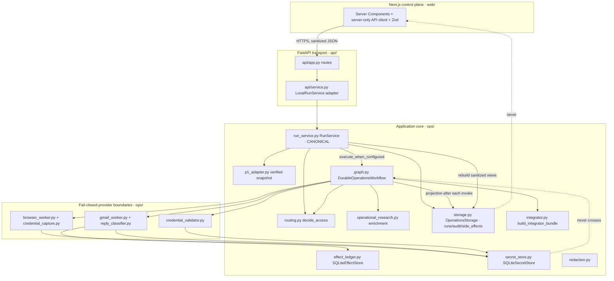
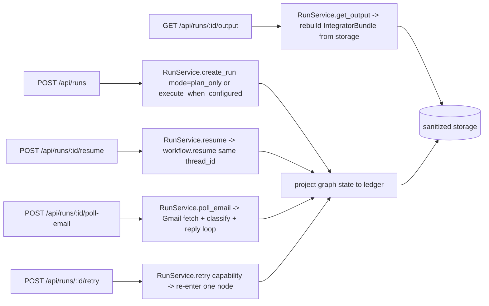
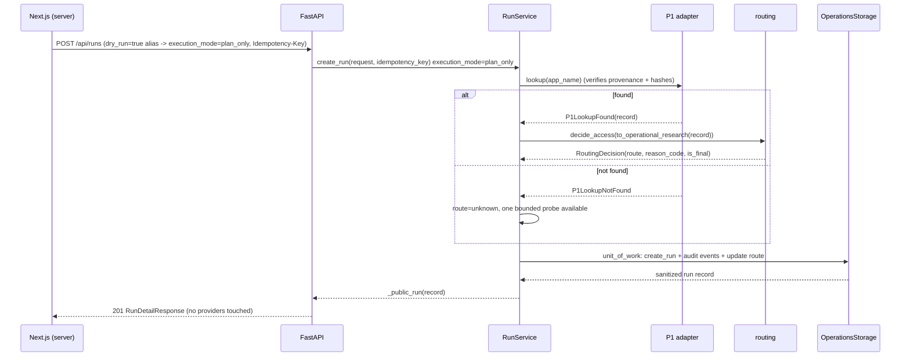

# Design Document

Feature: `end-to-end-operations-runtime`
Workflow: design-first (High-Level Design + Low-Level Design)
Status: design only. No implementation, tests, fixtures, prompts, config, or CI are changed by this document.

This document is grounded in the current repository state (branch `main`, HEAD `7b973c4`). Where the code and the README/PLAN disagree, the code is treated as the source of truth. Sections explicitly separate what is real, what is a typed stub, and what is fixture versus live.

---

## 1. Overview / feature intent

The product turns a provenance-locked P1 research catalog into explainable, secure integration-access operations. A single run should move through:

```
app input
  -> verified P1 lookup
  -> optional official-evidence enrichment (missing operational fields only)
  -> deterministic routing
  -> durable LangGraph execution
  -> Browser path OR Gmail path
  -> HITL interrupt and same-thread resume
  -> secure credential capture (Playwright, deterministic)
  -> read-only credential validation
  -> reference-only IntegratorBundle
  -> sanitized FastAPI responses
  -> accurate Next.js frontend state
```

The intent of this feature is not to build new capability modules. Nearly all of them already exist. The intent is **convergence**: to make the public runtime (FastAPI + Next.js) actually driven by the durable LangGraph workflow and the provider adapters, replacing the current arrangement where those components exist beside the public runtime rather than powering it.

The design must honor the structure rule: extend the one canonical application service (`ops/run_service.py::RunService`), the one router (`ops/routing.py`), the one redactor (`ops/redaction.py`), the one vault (`ops/secret_store.py`), the one effect ledger (`ops/effect_ledger.py`), and the one status vocabulary (`ops/state.py::RunStatus`). It must not introduce a second of any of these. Provider SDK imports remain lazy and inside provider boundaries.

Execution is governed by a **single** control, `execution_mode`, with two values:

- `plan_only` — no network or provider actions; the run computes P1 lookup, routing, and the sanitized baseline and then **terminates at `route_selected`**. `route_selected` is the terminal state for a planning-only run; a plan-only run never reaches `completed`, because nothing was executed and there is no bundle to complete.
- `execute_when_configured` — the durable workflow runs only configured, policy-enabled capabilities and otherwise records `configuration_required` honestly.

`execution_mode` is the only runtime execution control. The legacy `dry_run: true` request flag is a **deprecated compatibility alias**: `dry_run=true` maps to `execution_mode=plan_only`. `dry_run` is not an independent runtime control and is not consulted once the request is normalized. (The persisted/serialized `execution_mode` column in `ops/storage.py` currently stores the code-level token `local_dry_run` for `plan_only` and `operations` for `execute_when_configured`; the projection layer maps between the logical values and the stored tokens so a single vocabulary is presented at the API boundary.)

---

## 2. Current architecture (code-grounded)

### 2.1 What is real and executed today

- **Verified P1 snapshot lookup.** `ops/p1_adapter.py` reads `data/p1/{SNAPSHOT.json,results.json,composio_coverage.json}`, verifies pinned provenance (`LOCKED_SOURCE_COMMIT`, `LOCKED_RESULTS_SHA256`, `LOCKED_COVERAGE_SHA256`) with `hmac.compare_digest`, opens files with `O_NOFOLLOW`, enforces size bounds, and strictly parses the locked 19-field `P1AppRecord`. Lookups are exact normalized app/slug matches returning a typed `P1LookupFound | P1LookupNotFound`. `to_operational_research()` maps only fields P1 actually contains; everything else stays `None`/`[]`. This is real and covered by tests (`test_snapshot.py`, `test_phase2.py`).
- **Deterministic routing.** `ops/routing.py::decide_access` applies fixed-priority rules and models exactly one bounded unknown-probe. Real, tested.
- **Local dry-run run service.** `ops/run_service.py::RunService.create_run` verifies P1, builds a conservative baseline, records the route, persists a sanitized run + audit events inside a single `OperationsUnitOfWork` transaction, and enforces idempotency by `Idempotency-Key` + request fingerprint. It **rejects any non-dry-run request** (`if not request.dry_run: raise ValueError`). Real, tested (`test_run_service.py`).
- **Sanitized persistence.** `ops/storage.py` writes runs/audit/side-effect intents to owner-only SQLite, redacting every free-form value, refusing to persist `browser_live_url`, and exposing a `side_effect_intents` table plus `reserve_side_effect`/`update_side_effect`. Real, tested (`test_storage_operations.py`).
- **Encrypted secret vault.** `ops/secret_store.py` is a Fernet-encrypted, exact-reference SQLite vault with no list/enumerate method. Real, tested (`test_secret_store.py`).
- **Effect ledger.** `ops/effect_ledger.py::SQLiteEffectStore` provides atomic `reserve` with states `pending/completed/outcome_unknown/failed`, refuses blind resend after ambiguous outcomes (`reconcile_required`), and validates receipts contain no secret-like values.
- **Redaction.** `ops/redaction.py` provides `redact_text`/`redact_data` and a `RedactingFilter` installed on the API logger. Real, tested (`test_redaction.py`).
- **FastAPI transport.** `api/app.py` + `api/service.py::LocalRunService` expose the sanitized control-plane API with strict Pydantic v2 models, security headers, CORS allowlist, and typed error envelopes. Real, tested (`test_api.py`, `test_api_operations.py`).
- **Next.js control plane.** `web/` renders runs/apps/system from the sanitized API via a server-only client (`web/src/lib/api.ts`) with Zod validation (`api-schemas.ts`). Real, tested (`test_frontend_boundaries.py` plus web tests).
- **Provider adapters as fail-closed boundaries.** `gmail_worker.py` (pinned tool allowlist, schema check, effect-ledger idempotency, pre-LLM secret extraction), `browser_worker.py` (fail-closed Browser Use, allowlist validation, trusted raw-browser CDP path, URL sanitization), `credential_capture.py` (deterministic Playwright capture returning only vault refs), `credential_validator.py` (read-only validation with endpoint allowlist), `operational_research.py` (Perplexity discovery + guarded official fetch + Gemini extraction with SSRF/allowlist/size/content-type guards), `integrator.py` (deterministic readiness). Provider SDKs are imported lazily via `importlib` inside methods.

### 2.2 The core architectural problem (stated plainly)

**FastAPI and the frontend use the local dry-run `RunService`; the LangGraph workflow and provider adapters exist beside the public runtime, not powering it.**

Concrete evidence in code:

- `api/service.py::LocalRunService` wraps `ops/run_service.py::RunService`. Its `resume`, `poll_email`, and `retry` methods do **not** call the graph. They inspect settings and raise `PhaseUnavailableError(configuration_required)` or return `ActionReceipt(status="no_change")`. `get_output` returns a bundle only if one was already persisted (it never is, in dry-run).
- `ops/run_service.py::RunService.create_run` hard-rejects non-dry-run and never imports or invokes `ops/graph.py`.
- A repo-wide search for imports of `ops.graph` finds only `developer_app_worker.py`, `outreach.py`, and `reply_classifier.py` importing the **error type** `PhaseUnavailableError`. **Nothing imports `build_graph`, `start_workflow`, `resume_workflow`, or `DurableOperationsWorkflow` for execution.**
- The durable workflow `ops/graph.py::DurableOperationsWorkflow` is fully written (encrypted `SqliteSaver`, `StateGraph`, `interrupt()`, `Command(resume=...)`, per-thread locks) but is **not wired to any public command**.

### 2.3 Live vs fixture, and dry-run vs LangGraph split

- **Dry-run path (real, exercised):** P1 lookup + routing + sanitized persistence via `RunService`. No providers.
- **LangGraph path (written, not exercised end to end):** `ops/graph.py` has zero executed durable behavior in the test suite. The only test touching it, `tests/test_boundaries.py::test_graph_is_explicitly_unavailable`, asserts `build_graph()` raises `PhaseUnavailableError` "Phase 3" when `LANGGRAPH_AES_KEY` is absent (the `ConfigurationRequiredError(phase=3, reason_code="langgraph_aes_key_missing")` branch). There is **no test** that starts the graph, hits an interrupt, restarts the process, resumes the same thread, or asserts a single side effect. So durable/HITL behavior is currently **unproven by execution**.
- **Provider adapters (fail-closed, fixture-only):** `test_boundaries.py` asserts Browser (`Phase 5`), Credential Capture (`Phase 6`), and Gmail (`Phase 4`) boundaries raise `PhaseUnavailableError` without configuration, and that provider boundary modules make no static external-SDK imports. No live provider evidence exists. Any provider payload used in tests is a sanitized fixture/fake, never live evidence.

### 2.4 Committed vs uncommitted (from `git status`)

- Committed on `main` (HEAD `7b973c4`): all of `ops/`, `api/`, `web/`, `tests/`, `data/p1/`, Docker/compose/CI, `PLAN.md`, `DECISIONS.md`, `README.md`.
- **Untracked (not committed):** `.kiro/` (all steering and skills), `AGENTS.md`, `KIRO_SETUP.md`, `MANIFEST.txt`. This means the steering/skills guidance that governs this work is not yet in version control. This spec directory (`.kiro/specs/end-to-end-operations-runtime/`) is likewise untracked until a future commit.
- Git was inspectable in this session; the above is reported from `git status`/`git log`, not guessed.

---

## 3. Target architecture (single canonical runtime)

The convergence keeps `RunService` as the single application service and gives it an owned, optional workflow engine. `RunService` gains an execution mode and delegates durable execution to `ops/graph.py::DurableOperationsWorkflow`, then **projects** graph state back into the sanitized ledger. All public responses are rebuilt from sanitized storage, never from raw checkpoint state.



Key rules encoded in the diagram:

- `RunService` is the only thing the API talks to. The API never imports `ops/graph.py`, providers, storage internals, the vault, or the effect ledger directly.
- `DurableOperationsWorkflow` is owned and invoked only by `RunService`. After each `invoke`/`resume`, `RunService` projects the returned `OperationsState` into `OperationsStorage` (runs, audit, side-effect intents) and rebuilds public views from storage.
- The vault (`secret_store.py`) is reachable only from provider boundaries (`credential_capture`, `credential_validator`, `gmail_worker` secret extraction). Raw secrets never enter graph state, the checkpoint payload contract, storage, or API.
- The effect ledger sits behind provider boundaries (Gmail today; browser/validation as they execute) and is mirrored as sanitized `side_effect_intents` rows in `OperationsStorage`.

---

## 4. State ownership (7 domains)

Each domain names its owning module, storage backing, read/write boundary, and what may not cross.

| # | Domain | Owner | Storage backing | Write boundary | Read boundary | Must NOT cross |
|---|--------|-------|-----------------|----------------|---------------|----------------|
| 1 | Operations ledger state (run record, status, route, research projection, missing fields, provider status, execution mode, external_actions) | `ops/run_service.py::RunService` via `ops/storage.py::OperationsStorage` | `private/*.db` -> `runs`, `audit_events` tables | Only through `OperationsUnitOfWork` inside `RunService`; every free-form value passes `redact_data`/`_structured_json` | `RunService` read methods; projected to API by `LocalRunService` | Raw provider payloads, secrets, `browser_live_url` (storage raises if set), env values, DB paths |
| 2 | LangGraph checkpoint state | `ops/graph.py::DurableOperationsWorkflow` | `CHECKPOINT_DB_PATH` (default `private/checkpoints.db`), encrypted via `EncryptedSerializer.from_pycryptodome_aes` over `SqliteSaver` | Only the compiled graph, keyed by stable `thread_id`; `LANGGRAPH_STRICT_MSGPACK=true`, pickle fallback disabled | `RunService` reads state/interrupts through workflow methods, then projects into domain 1 | Raw secrets (state has no secret fields, only `vault://` refs and non-secret IDs); checkpoint bytes never returned by API |
| 3 | Provider side-effect ledger | `ops/effect_ledger.py::SQLiteEffectStore` (behind provider boundaries) | `PROVIDER_EFFECTS_DB_PATH` (default `private/provider_effects.db`) -> `external_effects` | Provider adapters via `reserve`/`complete`/`mark_outcome_unknown`/`mark_failed`; receipts validated secret-free | Provider adapter reconciliation; sanitized mirror in `side_effect_intents` | Secret-like receipt values (ledger rejects them), raw provider responses |
| 4 | Secret vault | `ops/secret_store.py::SQLiteSecretStore` | `SECRET_VAULT_DB_PATH` (default `private/secret_vault.db`), Fernet-encrypted, owner-only | `put()` from `credential_capture` and `gmail_worker` secret extraction only | `get()` from `credential_validator` and SDK-init boundaries only, by exact reference | Raw values anywhere else; there is no list/reveal/export interface |
| 5 | Provider capability state (per-capability availability/status/reason_code) | `ops/models.py::CapabilityAvailability`, produced by provider boundaries + `ops/config.py::Settings` | Transient in `OperationsState.capability_statuses`; projected to `runs.provider_status_json` | Provider boundaries and `RunService` projection | API `provider_states`/`phases`; frontend `ProviderStatus` | Provider payloads, keys, connected-account tokens |
| 6 | API command results (request/response envelopes, receipts, error envelopes) | `api/models.py` + `api/service.py::LocalRunService` | None (derived, rebuilt from domain 1 each call, `no-store`) | FastAPI route handlers only | HTTP clients | Any field not in the strict Pydantic model (`extra="forbid"`); vault values; internal exceptions |
| 7 | Frontend-visible status | `web/src/lib/types.ts` + `api-schemas.ts` (Zod), Server Components | None persisted; no browser storage of run/credential data | Server Components fetch via server-only `OPS_API_URL` | Rendered UI | Secret material, `OPS_API_URL`, raw provider HTML (no `dangerouslySetInnerHTML`) |

Cross-cutting invariant: **only exact `vault://<app>/<kind>/<id>` references may cross general application boundaries** (domains 1, 2, 5, 6, 7). Domains 3 and 4 are the only places raw values or receipts live, and both validate against secret leakage.

`external_actions` invariant (domain 1): the run-record boolean `external_actions` becomes `true` **only after a confirmed external-effect receipt is durably recorded** in the provider effect ledger (domain 3, status `completed` with a validated non-secret receipt) and mirrored into `side_effect_intents`. A reservation (`reserved`/`pending`), an attempted-but-ambiguous call (`outcome_unknown`/`reconcile_required`), or a failed call never sets `external_actions=true`. The projection layer reads the effect-ledger outcome, not the intent, before flipping the flag. In `plan_only` runs `external_actions` is always `false`.

**Workflow lifecycle ownership (domain 2).** `RunService` owns the single `DurableOperationsWorkflow` instance for the process. `api/app.py`'s `lifespan` context manager wires its creation and teardown: on startup it calls `active_service.startup()` (which constructs/opens the workflow and its encrypted checkpoint connection when `LANGGRAPH_AES_KEY` is present, otherwise leaves it `None` and reports `configuration_required`); on shutdown it calls `active_service.shutdown()`, which closes the workflow (`DurableOperationsWorkflow.close()` closes the SQLite checkpoint connection under the database lock) and disposes provider adapters. The API never constructs, holds, or closes the workflow or its checkpoint connection directly — it only holds the `RunService` on `application.state.run_service`. See §5.1 for the exact lifespan sequence.

---

## 4A. Cross-database consistency and recovery

The runtime spans four independent SQLite databases, each owner-only (`0600`, `private/`). They are not transactionally linked, so consistency is defined by explicit ownership, a monotonic revision, idempotent projection, and startup reconciliation rather than by a distributed transaction.

### 4A.1 The four databases and their authority

| Database | Path (Settings) | Owner | Authoritative for | Never authoritative for |
|----------|-----------------|-------|-------------------|-------------------------|
| Encrypted LangGraph checkpoint DB | `checkpoint_db_path` (`private/checkpoints.db`) | `DurableOperationsWorkflow` | **Execution truth** — the live position of the graph, interrupts, and in-flight `OperationsState` | Public presentation; external-effect landing |
| Sanitized operations ledger DB | `ops_db_path` (`private/ops.db`) | `RunService` via `OperationsStorage` | **Sanitized public projection** — run record, status, audit, `side_effect_intents` mirror | Execution truth; credential values |
| Provider effect ledger DB | `provider_effects_db_path` (`private/provider_effects.db`) | `SQLiteEffectStore` (behind provider boundaries) | **External-effect truth** — whether a provider action was reserved/completed/ambiguous/failed | Run status; credential values |
| Secret vault DB | `secret_vault_db_path` (`private/secret_vault.db`) | `SQLiteSecretStore` | **Credential truth** — Fernet ciphertext keyed by exact `vault://` reference | Anything else; it has no list/reveal/export |

Precedence when sources disagree: **checkpoint = execution truth**, **effect ledger = external-effect truth**, **vault = credential truth**, and the **operations ledger is a derived projection** that must never override the other three. The API reads only the operations ledger; it is rebuilt from the authoritative sources during reconciliation.

### 4A.2 Monotonic revision and idempotent projection

- Each run carries a monotonic `state_revision` counter, incremented by the workflow on every committed checkpoint (or, for `plan_only`, by `RunService` on every ledger mutation).
- The operations ledger stores `last_projected_revision` per run.
- **Projection is idempotent**: `project(run_id, state, revision)` applies a graph state to the ledger only when `revision > last_projected_revision`; equal or lower revisions are no-ops. Re-running a projection after a crash produces the same ledger row, never a duplicate audit event or a status regression.
- Every projection calls the single `validate_status_transition(previous_status, next_status, command)` (see §6) before writing; an illegal transition is rejected and raises rather than silently overwriting.

### 4A.3 Per-run command serialization

All mutating commands for one run (`resume`, `poll-email`, `retry`, and the initial `create` in `execute_when_configured`) are serialized per `run_id`. The mechanism reuses the workflow's existing per-thread `RLock` (`graph.py::DurableOperationsWorkflow._lock`) plus an optimistic guard on `state_revision`: a command reads the expected revision, and the projection write is conditioned on `last_projected_revision` being unchanged. A losing writer does not partially apply; it returns a typed conflict (§4A.6).

### 4A.4 Startup reconciliation

On `RunService.initialize()`/API startup, for every run not in a terminal state (`completed`, `blocked`):

1. Load the authoritative checkpoint state for the run's `thread_id` (if a workflow is configured).
2. Load the effect-ledger outcomes for that run's reserved keys.
3. Recompute the sanitized projection and reconcile the ledger to `max(checkpoint_revision, last_projected_revision)`.
4. Flip `external_actions` only if the effect ledger shows a `completed` receipt.

### 4A.5 Recovery scenarios

- **Checkpoint committed before ledger projection** (process died between graph commit and ledger write): checkpoint `state_revision` is ahead of `last_projected_revision`. Reconciliation replays the idempotent projection forward; no double-apply because projection is revision-guarded.
- **Provider effect occurred before graph checkpointing** (effect ledger shows `completed`/`outcome_unknown` but the checkpoint predates it): the node restarts on resume, re-reserves the same idempotency key, sees `completed` (returns stored receipt, no resend) or `reconcile_required` (triggers a provider read, never a blind resend). `external_actions` is set from the effect-ledger receipt, not from the checkpoint.
- **Ledger ahead of checkpoint** (ledger projected a status the checkpoint does not yet reflect): impossible to trust the ledger over the checkpoint — the checkpoint wins; the ledger is corrected downward only through a legal transition, otherwise the run is marked for manual review rather than silently rewound.
- **Stale projection detection**: if `last_projected_revision > checkpoint_revision` for a live thread, the ledger is stale/ahead and is flagged; the API surfaces the last legal status and reconciliation resolves it against the checkpoint.

### 4A.6 Conflict resolution and the typed conflict envelope

Competing mutating commands on the same run (e.g., concurrent `resume` + `poll-email`, or a duplicate `resume`) resolve as: the first command acquires the per-run lock and advances `state_revision`; the second observes a revision mismatch (or an already-consumed HITL request, §8) and returns a **typed conflict** rather than mutating. The conflict is expressed with the existing strict error-envelope machinery:

```json
{
  "error": "run_conflict",
  "message": "A competing command is already modifying this run.",
  "run_id": "run_<32hex>",
  "action": "resume | poll_email | retry",
  "external_actions": false
}
```

HTTP status: **409 Conflict** (same status family as the existing `PhaseUnavailableResponse`/`IdempotencyConflictResponse`; `run_conflict` is added to the error-literal union rather than creating a new envelope class). No competing command performs a partial write or an external action.

## 5. Command flows (5 endpoints -> runtime operations)

All five become real commands on the canonical runtime. `RunService` gains a mode-aware surface; `LocalRunService` stays the sanitizing HTTP adapter.



- **POST /api/runs** — Create+route. In `plan_only` (default while live actions are disabled) it behaves exactly like today's `create_run` (P1 lookup, baseline, route, persist). In `execute_when_configured` it additionally starts the durable workflow on a stable `thread_id`; the workflow runs only configured, policy-enabled capabilities and otherwise records `configuration_required`.
- **POST /api/runs/{id}/resume** — Resume a HITL-interrupted run via `Command(resume=...)` on the **same** `thread_id`, then project state.
- **POST /api/runs/{id}/poll-email** — Drive the Gmail fetch -> sanitize -> classify -> reply loop for gated runs; each provider action is idempotency-reserved.
- **POST /api/runs/{id}/retry** — Re-enter exactly one capability node (`research|browser|email|validation`) using idempotent reservations, never a blind replay.
- **GET /api/runs/{id}/output** — Rebuild and validate the `IntegratorBundle` from sanitized storage; return reference-only.

**Synchronous result contract (no `accepted`).** The runtime has **no background worker and no command queue**; every command executes synchronously inside the request. Therefore a command must return its **actual resulting run status**, never a speculative `accepted`. `accepted` would falsely imply durable queuing of not-yet-done work. Each command returns one of the real resulting statuses drawn from the single `RunStatus` vocabulary: `route_selected`, `waiting_for_hitl`, `configuration_required`, `no_change`, `blocked`, `failed`, or `completed`. (`no_change` is a receipt-level outcome meaning the command was legal but the run state was already at rest; it is not a run status stored in the ledger.) The `ActionReceipt.status` union in `api/models.py` is widened from `{accepted, configuration_required, no_change}` to this resulting-status set so the transport can report the truth; `accepted` is removed.

### 5.1 API lifespan wiring for the durable workflow

```mermaid
sequenceDiagram
  participant API as FastAPI lifespan (api/app.py)
  participant RS as RunService (owns workflow)
  participant WF as DurableOperationsWorkflow
  participant CP as Encrypted SqliteSaver (checkpoints.db)

  API->>RS: startup()
  RS->>RS: storage.initialize(); verify P1 snapshot
  alt LANGGRAPH_AES_KEY present
    RS->>WF: build_graph(checkpoint_path, key, deps)
    WF->>CP: open owner-only connection + encrypted serializer
  else key absent
    RS->>RS: workflow = None (commands return configuration_required)
  end
  API->>API: app.state.run_service = RS ; yield
  Note over API: requests served; RunService is the only handle
  API->>RS: shutdown()
  RS->>WF: close() (closes CP connection under DB lock)
  RS->>RS: dispose provider adapters
```

`RunService` owns the workflow instance for the process lifetime; the FastAPI `lifespan` context manager is the only place that triggers its creation (`startup`) and teardown (`shutdown`). Provider adapter cleanup (Browser Use client `close`, Composio client `close`) is invoked from the same `shutdown` path so no provider connection outlives the app.

---

## 6. Status transition table

Status vocabulary is the single `ops/state.py::RunStatus` (extended only if a real gap exists; today it already includes `configuration_required`, `waiting_for_hitl`, `blocked`, `failed`, `completed`). The frontend `types.ts` additionally lists `validating_credentials`; if the runtime needs that observable state, it is added to the one enum in `ops/state.py` and mirrored everywhere rather than created as a parallel vocabulary.

**Single transition validator.** There is exactly one transition authority, owned by the domain layer: `validate_status_transition(previous_status, next_status, command)` in `ops/` (co-located with `ops/state.py::RunStatus`, the single status vocabulary). Every projection call in `RunService` invokes it before writing to the ledger. The API (`api/service.py`, `api/models.py`), the graph (`ops/graph.py`), storage (`ops/storage.py`), and the frontend (`web/`) MUST NOT keep separate transition logic; they consume the one validator's verdict (or the status it produced). This removes the parallel "is_final" heuristics currently scattered across `api/service.py` and the graph.

Legal transitions (any transition not listed is illegal and rejected by `validate_status_transition`, invoked by the projection layer):

| From | To (legal) | Trigger |
|------|-----------|---------|
| `created` | `researching` | run initialized |
| `researching` | `route_selected`, `researching` (one bounded probe), `configuration_required`, `blocked`, `failed` | routing / enrichment |
| `route_selected` | `browser_running`, `outreach_sent`, `configuration_required`, `blocked`, `failed` | route dispatch (`execute_when_configured` only) |
| `browser_running` | `waiting_for_hitl`, `credentials_ready`, `configuration_required`, `blocked`, `failed` | browser observation |
| `waiting_for_hitl` | `browser_running`, `blocked` (resume=cancelled), `failed` | `resume` on same thread |
| `outreach_sent` | `waiting_for_reply`, `configuration_required`, `failed` | Gmail send receipt |
| `waiting_for_reply` | `waiting_for_reply` (bounded rounds), `browser_running` (approved_setup), `credentials_ready`, `blocked` (rejected), `configuration_required`, `failed` | poll-email classification |
| `credentials_ready` | `completed`, `failed` | validation outcome |
| `configuration_required` | `researching`, `browser_running`, `outreach_sent`, `waiting_for_reply` | retry after config provided |
| `blocked` | (terminal) | — |
| `failed` | `researching`/`browser_running`/`outreach_sent` via explicit retry only | bounded retry |
| `completed` | (terminal) | — |

Rules:
- **Plan-only terminal state is `route_selected`.** A run created with `execution_mode=plan_only` stops at `route_selected` with `external_actions=false`; it never advances to `browser_running`/`outreach_sent` and never reaches `completed`. There is no `route_selected -> completed` edge, because `plan_only` performs no execution and produces no bundle to complete.
- Terminal states: `completed`, `blocked`. `failed` is terminal unless an explicit, bounded `retry` re-enters a specific node.
- `configuration_required` is a first-class non-terminal state: it means a capability truthfully did not run. It is never presented as success.
- HITL/interrupt maps to `waiting_for_hitl`; resume is only legal from `waiting_for_hitl` on the same `thread_id`, and only via the canonical `{request_id, signal}` contract (§10). The `request_id` must be live, unconsumed, and thread-matched; stale, already-consumed, thread-mismatched, or duplicate resumes are rejected with the typed `run_conflict` (§4A.6) and never issue a second `Command(resume=...)`.
- The projection layer validates predecessor+successor legality before writing (satisfying secure-orchestration "illegal transition rejection").

---

## 7. Plan-only sequence



No network or provider action occurs. The run **terminates at `route_selected`** (or `researching` while its one bounded probe is still available); it does not advance to `completed`. `external_actions=false`, `execution_mode=plan_only` (stored token `local_dry_run`). The response `status` is the real resulting status (`route_selected`/`researching`), never `accepted`.

---

## 8. Browser sequence (fail-closed Browser Use; Playwright for secret steps)

**Autonomous Browser Use navigation is UNSUPPORTED** while the installed SDK cannot prove the mandatory domain restriction. `browser_worker.py::BrowserWorker.start` / `navigate_onboarding` / `resume_after_hitl` all raise `ProviderContractError(v3_domain_restriction_unavailable)` because the v3 agent session exposes no typed `allowed_domains` control the runtime can enforce. The design does **not** downgrade to unrestricted agent navigation; it fails closed to `contract_incompatible`.

**First supported controlled browser flow: deterministic, adapter-owned Playwright navigation.** Instead of an LLM agent choosing where to go, the registered app adapter (§Developer-portal adapter registry) supplies the ordered, non-secret navigation steps as selectors and target URLs (developer portal URL, login-ready signal, developer-app lookup/creation selectors, callback/scope selectors, credential-page selectors, credential field selectors, challenge-detection hints, completion signal). Deterministic Playwright-over-CDP code walks those adapter-owned steps, validating the page host against `allowed_domains` immediately before every action via `is_allowed_browser_url`. No adapter for the app ⇒ `configuration_required` (never a guessed selector, never agent navigation).

Credential capture (`CredentialCapture`) is **one step inside** this adapter-driven flow — the final read on the adapter's credential page — not the whole flow. Capture alone does not constitute browser onboarding; onboarding requires the adapter's navigation, developer-app lookup/creation, callback/scope configuration, challenge→HITL handling, and the completion signal to have run first. If a challenge (CAPTCHA/OTP/passkey/etc.) is detected by the adapter's challenge hints, the flow escalates to HITL and never bypasses it.

```mermaid
sequenceDiagram
  participant RS as RunService/Workflow
  participant BW as BrowserWorker (fail-closed)
  participant RAW as run_trusted_raw_browser
  participant CC as CredentialCapture (Playwright/CDP)
  participant VA as SecretStore

  RS->>BW: start(profile) [execute_when_configured]
  alt live browser not enabled / SDK cannot enforce allowlist
    BW-->>RS: ConfigurationRequiredError | ProviderContractError
    RS->>RS: status=configuration_required (truthful, no fake success)
  else trusted deterministic capture only
    RS->>BW: run_trusted_raw_browser(profile, operation=CC.for_operation(...))
    BW->>RAW: browsers.create -> ephemeral cdp_url (never persisted/logged)
    RAW->>CC: execute(cdp_url)
    CC->>CC: connect_over_cdp; assert page host in allowed_domains
    CC->>CC: read exactly-one selector value (no LLM)
    CC->>VA: put(app_slug, kind, raw_value) -> vault ref
    CC-->>RAW: {kind: vault://...}
    RAW->>BW: stop remote browser (finally)
    BW-->>RS: credential_refs (references only)
  end
```

Boundaries: `allowed_domains` mandatory and validated (`validate_allowed_domains`); `is_allowed_browser_url` re-checked before each field read; `cdp_url`/`live_url` are ephemeral and never enter state, logs, storage, or API; CAPTCHA/OTP/passkey/etc. escalate to HITL, never bypass.

---

## 9. Gmail sequence (polling, sanitization, classification, reply loop)

```mermaid
sequenceDiagram
  participant RS as RunService/Workflow
  participant GW as GmailWorker
  participant EL as EffectLedger
  participant VA as SecretStore
  participant RC as ReplyClassifier (Gemini, sanitized input)

  RS->>GW: send_outreach(recipient, subject, body, idem_key)
  GW->>GW: actual_recipient = override (or blocked unless ALLOW_LIVE_VENDOR_EMAIL)
  GW->>EL: reserve(composio_gmail, send_outreach, idem_key)
  alt completed
    EL-->>GW: receipt -> return (no resend)
  else reserved
    GW->>GW: schema-check GMAIL_SEND_EMAIL -> execute
    GW->>EL: complete(receipt: session/thread/message ids)
  end
  GW-->>RS: GmailSendResult (ids only) -> status=waiting_for_reply

  RS->>GW: poll: fetch_thread(thread_id)
  GW->>GW: deterministic secret detector on each message body
  GW->>VA: put(email-import, kind, raw_secret) -> ref ; body -> [REDACTED_SECRET:kind]
  GW-->>RS: SanitizedGmailThread (+ credential_refs)
  RS->>RC: classify(sanitized_thread, company)
  RC-->>RS: ReplyClassification (class, questions, setup_urls, next_action)
  alt more_information_required
    RS->>GW: reply(thread_id, body, idem_key) (bounded rounds <= MAX_OUTREACH_ROUNDS)
  else approved_setup_required
    RS->>RS: verify EVERY setup_url vs official-host allowlist (OfficialURLPolicy.from_p1_record)
    alt all setup URLs official
      RS->>RS: transition to browser path
    else no official setup URL remains
      RS->>RS: drop unverified URLs; status=configuration_required (no browser transition)
    end
  else credentials_received
    RS->>RS: refs already vaulted -> validation
  else rejected
    RS->>RS: status=blocked
  end
```

Order is non-negotiable: fetch -> deterministic secret extraction to vault -> `[REDACTED_SECRET:*]` placeholders -> sanitized thread -> classifier. Raw email bodies never reach the LLM or logs. `ReplyClassifier` is currently a typed stub (`PhaseUnavailableError(phase=4)`); wiring it is part of the Gmail vertical slice.

### 9.1 Bounded rounds (Settings caps)

Every Gmail loop is bounded by `ops/config.py::Settings`; a run may never loop unboundedly:

- **Outreach/reply rounds** ≤ `MAX_OUTREACH_ROUNDS` (default `5`). `state.outreach_round` increments per send/reply; on reaching the cap the run stops at `configuration_required` (needs human review), never a further auto-reply.
- **Unclear-reply retries** ≤ `MAX_UNCLEAR_RETRIES` (default `1`). An `unclear` classification may re-poll/re-ask at most this many times, then stops.
- **Poll count** is bounded per command: one `poll-email` command performs at most one bounded fetch+classify pass (no internal unbounded polling loop); repeated polling is driven by explicit operator/CLI commands, each still subject to `MAX_OUTREACH_ROUNDS`.

### 9.2 Official-host allowlist gate before the Gmail→browser transition

When a reply is classified `approved_setup_required` and carries setup URLs, the runtime MUST verify **every** setup URL against the official-host allowlist (built from the P1 record via `OfficialURLPolicy.from_p1_record`: exact host/subdomain match, HTTPS-only, standard port) **before** transitioning from the Gmail path to the browser path. A setup URL that is not on the official-host allowlist is dropped; if no official setup URL remains, the run does not enter the browser path and records `configuration_required` with a truthful reason rather than navigating to an unverified host.

### 9.3 Sanitized ReplyClassifier input/output contracts

The classifier operates strictly on already-sanitized data. Raw Gmail content MUST NEVER reach it.

**Input contract** (`ReplyClassifier.classify`): only sanitized thread fields — the existing `SanitizedGmailThread` (`thread_id`, and per message: `message_id`, `sender`, `recipients`, `sent_at`, `sanitized_subject`, `sanitized_body`) where every body has already had secrets extracted to the vault and replaced with `[REDACTED_SECRET:<kind>]` placeholders — plus `app_name` and the non-secret `CompanyProfile` (whose `work_email_ref` is a `vault://` reference, never a raw address). No raw message payload, no headers beyond the sanitized fields, no credential values, no `vault://` values are expanded.

**Output contract** (`ReplyClassification`): a bounded, typed structure only —
- `classification`: the `ReplyClass` enum (`no_reply | more_information_required | meeting_requested | approved_setup_required | credentials_received | rejected | automated_response | unclear`);
- `explicit_questions`: a bounded tuple of short provider questions (count- and length-capped);
- `official_setup_urls`: URLs that pass the §9.2 official-host allowlist only (others are discarded before output);
- `stated_reason`: optional bounded string;
- `required_next_action` / `start_browser_onboarding`: the deterministic next action, never free-form provider text echoed back.

The classifier returns no raw email text, no secrets, and no non-allowlisted URLs; its output is validated before it can influence a status transition.

---

## 10. HITL restart/resume sequence (durable interrupt + same-thread resume)

```mermaid
sequenceDiagram
  participant P1proc as Process A
  participant WF as DurableOperationsWorkflow
  participant CP as Encrypted SqliteSaver (checkpoints.db)
  participant P2proc as Process B (after restart)

  P1proc->>WF: start(request, thread_id=stable)
  WF->>WF: initialize->research->route->browser_navigate
  WF->>WF: human_interrupt node: interrupt(sanitized HitlRequest)
  WF->>CP: checkpoint persisted (encrypted, no secrets)
  WF-->>P1proc: state waiting_for_hitl (interrupts present)
  Note over P1proc: process exits / DB connection closed

  P2proc->>WF: build_graph() reopens encrypted saver on same checkpoints.db
  P2proc->>WF: resume({request_id: hitl_<id>, signal: completed})
  WF->>WF: validate request_id: live, unconsumed, thread matches; else typed conflict
  WF->>CP: load checkpoint for thread_id
  WF->>WF: Command(resume=signal); interrupted node restarts from its start
  WF->>WF: browser_resume searches existing app before creating (idempotent)
  WF-->>P2proc: finalize -> IntegratorBundle; side-effect count == 1
```

**Canonical HITL resume request contract.** There is exactly one resume contract accepted by the runtime:

```json
{ "request_id": "hitl_<opaque-id>", "signal": "completed | cancelled | retry" }
```

`request_id` is an opaque, server-issued identifier minted when the interrupt is raised and stored (non-secret) alongside the interrupt in the checkpoint and mirrored into the sanitized ledger. `signal` reuses the existing `graph.py::_resume_signal` set (`completed | cancelled | retry`). The API `ResumeRequest` is extended to carry `request_id` in addition to `signal` (its `signal` literal is widened to include `retry` to match the domain). A `retry` signal re-enters the interrupted node from its beginning under the same effectively-once rules (§12): the re-entered node re-reserves its idempotency key and returns the stored receipt for an already-`completed` effect rather than blind-replaying it, so a resume-with-retry never produces a duplicate external action.

The runtime **rejects**, with the typed conflict envelope (§4A.6, `409`):
- **stale `request_id`** — does not match the interrupt currently outstanding for the thread;
- **already-consumed `request_id`** — a resume for that id was already applied (idempotent no-op / conflict, never a second `Command(resume=...)`);
- **mismatched thread** — the `request_id` was issued for a different `thread_id` than the addressed run;
- **duplicate resume command** — a concurrent second resume on the same run loses the per-run lock/revision guard (§4A.3) and returns `run_conflict`.

Only a live, unconsumed, thread-matched `request_id` from a run in `waiting_for_hitl` produces a real `Command(resume=signal)`. On acceptance the `request_id` is marked consumed before the graph advances, so a retry of the same HTTP call cannot double-resume.

Grounded facts: `graph.py` uses a stable `thread_id` (`_config`), an encrypted serializer (`_build_saver`), per-thread `RLock`, and `interrupt()`/`Command(resume=...)`. The interrupted node restarts from its beginning, so side effects (`browser_start`, `outreach_send`) live in nodes **before/after** the interrupt and check `side_effect_keys`/existing IDs first. This behavior is written but **currently unproven by tests** (see 2.3); the durable-HITL vertical slice must add the restart proof test.

---

## 11. Credential capture and validation sequence

```mermaid
sequenceDiagram
  participant CC as CredentialCapture (Playwright)
  participant VA as SecretStore (Fernet)
  participant CV as CredentialValidator
  participant EP as Provider read-only endpoint

  CC->>CC: attach over ephemeral CDP; assert host in allowed_domains
  CC->>VA: put(app_slug, kind, raw_value) -> vault://app/kind/id
  CC->>CC: del raw_value (local only)
  CC-->>Workflow: {kind: vault://...}  (references only)
  Note over Workflow: graph state/checkpoint stores refs, never values

  Workflow->>CV: validate(app_slug, credential_refs, read_only_endpoint)
  CV->>CV: endpoint must be in policy.allowed_endpoints (exact)
  CV->>VA: get(ref) -> raw value (boundary-local, in header only)
  CV->>EP: GET identity/health (follow_redirects=false)
  EP-->>CV: status code
  CV->>CV: del raw value; clear headers
  CV-->>Workflow: CredentialValidationResult(status, endpoint, http_status, checked_at, reason_code)
```

Only status/endpoint/HTTP code/timestamp/reason_code persist; no response body. Raw values exist only inside `CredentialCapture` locals, the vault encryption boundary, and the `CredentialValidator` header construction — exactly the allowed boundaries.

---

## 12. Effectively-once side-effect strategy

Applies to Gmail sends/replies (real today) and, as they execute, browser app-creation and validation.

**Effectively-once, not exactly-once.** The runtime guarantees *effectively-once* execution: an **atomic local reservation** before the call, a **durable non-secret receipt** on success, **reconciliation after ambiguous outcomes**, and **no blind replay**. It does **not** claim exactly-once remote *delivery*: when a provider offers no idempotency key of its own, a network failure after the provider committed but before we recorded the receipt can leave the true outcome ambiguous. In that case the runtime records `outcome_unknown` and resolves it with a provider read (reconciliation), rather than resending. Remote exactly-once delivery cannot be guaranteed for providers without native idempotency; the honest guarantee is effectively-once with reconciliation.

1. **Reservation before execution.** Compute a stable idempotency key derived from `run_id` + logical action (e.g. `f"{run_id}:initial-outreach"`). Call `SQLiteEffectStore.reserve(provider, action, key)` inside `BEGIN IMMEDIATE`.
   - `reserved` -> proceed.
   - `completed` -> return stored receipt, do not resend.
   - `reconcile_required` (prior `outcome_unknown`) -> raise `ProviderOperationError(reconciliation_required)`; never blind-replay.
   - prior `failed` -> reset to `pending` and retry (bounded).
2. **Execute the provider call once.**
3. **Truthful receipts.** On success, `complete(receipt=ids)`; receipts are validated to contain only bounded non-secret string identifiers (`session_id`, `thread_id`, `message_id`, recipients). On provider-reported failure, `mark_failed`. On ambiguous outcome (exception after send, missing identifiers), `mark_outcome_unknown`.
4. **Reconciliation on ambiguity.** An `outcome_unknown`/`reconcile_required` effect is resolved by a provider-specific read (e.g. list-threads / fetch-by-thread-id) that determines whether the effect actually landed, then transitions to `completed` or `failed`. Never a blind resend.
5. **Bounded retries.** `MAX_OUTREACH_ROUNDS`, `MAX_UNCLEAR_RETRIES`, `MAX_BROWSER_ATTEMPTS`, `MAX_HITL_COUNT` from `Settings` cap loops.
6. **Ledger mirroring.** After each effect, `RunService` mirrors a sanitized `side_effect_intents` row (`storage.reserve_side_effect`/`update_side_effect`) so the ledger and the durable graph stay synchronized and the API can report truthful state without touching the effect DB directly.
7. **`external_actions` flips only on a confirmed receipt.** The run-record `external_actions` boolean is set to `true` only when the effect ledger transitions to `completed` with a validated non-secret receipt (§4A). A `reserved`/`pending` reservation or an `outcome_unknown`/`reconcile_required`/`failed` outcome never sets it. This is the observable, truthful signal that a real external action landed.

Restart safety: because reservation is atomic and separate from graph checkpointing, a process death between reserve and complete leaves the effect `pending`; on resume the interrupted node restarts, re-reserves the same key, sees `pending`, and the reconciliation read decides the outcome.

---

## 13. API changes (contracts for the 5 endpoints)

All models are strict Pydantic v2 (`extra="forbid"`, `hide_input_in_errors=True`), reusing `api/models.py`. No new status enum; reuse `RunStatus`, `AccessRoute`, `CapabilityStatus`, and the existing error envelopes.

**POST /api/runs**
- Request: `CreateRunRequest` (`app_name`, `company: CompanyInput` with `work_email_ref` as `vault://` ref, `requested_scope_policy`, optional `outreach_recipient_override`, and `execution_mode: "plan_only" | "execute_when_configured"` defaulting to `plan_only`). Header `Idempotency-Key` (`^idem_[0-9a-f]{32}$`).
- `execution_mode` is the single execution control. The legacy `dry_run: bool` field is retained only as a **deprecated compatibility alias**: `dry_run=true` normalizes to `execution_mode=plan_only`; supplying both must be consistent (a `dry_run=true` + `execution_mode=execute_when_configured` combination is rejected `422`). Once normalized, only `execution_mode` is consulted; while live capabilities are policy-disabled, `execute_when_configured` still runs no provider action and returns `configuration_required` honestly, so the contract cannot silently perform actions.
- Behavior: `plan_only` computes P1 lookup + routing + baseline and returns the run at its real resulting status (`route_selected`/`researching`). `execute_when_configured` additionally starts the durable workflow.
- Responses: `201 RunDetailResponse` (with the real resulting `status`, never `accepted`); `409 IdempotencyConflictResponse` (same key, different fingerprint); `409 run_conflict` (competing command on the same run); `422 InvalidRequestResponse`; `500 InternalErrorResponse`. Idempotent replay of the same key+fingerprint returns the existing run.

**POST /api/runs/{run_id}/resume**
- Request: canonical HITL resume contract `ResumeRequest` (`request_id: "hitl_<opaque-id>"`, `signal: "completed" | "cancelled" | "retry"`).
- Behavior: validate `request_id` (live, unconsumed, thread-matched) then resume the durable thread; legal only from `waiting_for_hitl` on the same `thread_id`.
- Responses: `200 ActionReceipt` carrying the **real resulting status** (`browser_running`/`waiting_for_hitl`/`blocked`/`credentials_ready`/`completed`/`configuration_required`/`failed`), never `accepted`; `409 PhaseUnavailableResponse` with `error="configuration_required"` when `LANGGRAPH_AES_KEY` absent or run not interrupted; `409 run_conflict` for a stale/consumed/mismatched `request_id` or a duplicate resume; `404 RunNotFoundResponse`.

**POST /api/runs/{run_id}/poll-email**
- Request: empty body.
- Behavior: drive one bounded Gmail fetch/classify/reply pass (bounded by `MAX_OUTREACH_ROUNDS`/`MAX_UNCLEAR_RETRIES`, §9.1); legal from `outreach_sent`/`waiting_for_reply`.
- Responses: `200 ActionReceipt` with the real resulting status (`waiting_for_reply`/`browser_running`/`credentials_ready`/`blocked`/`configuration_required`/`no_change`/`failed`), never `accepted`; `409` `configuration_required` when Composio/live-email not configured; `409 run_conflict` for a competing command; `404`.

**POST /api/runs/{run_id}/retry**
- Request: `RetryRequest` (`capability: "research"|"browser"|"email"|"validation"`).
- Behavior: re-enter one node via idempotent reservation (never a blind replay).
- Responses: `200 ActionReceipt` with the real resulting status (`researching`/`browser_running`/`outreach_sent`/`configuration_required`/`no_change`/`failed`), never `accepted`; `409 run_conflict` for a competing command; `404`.

**GET /api/runs/{run_id}/output**
- Behavior: rebuild+validate `IntegratorBundle` from sanitized storage.
- Responses: `200 RunOutputResponse` (`IntegratorBundleView`, `credential_refs` are `vault://` refs only); `409 PhaseUnavailableResponse` (`available_in=["output"]`) when no bundle yet; `404`.

Transport invariants preserved: `no-store`, strict CSP/`X-Frame-Options: DENY`/`nosniff`/`no-referrer`, CORS from `OPS_CORS_ORIGINS` allowlist, docs off unless `OPS_ENABLE_API_DOCS=true`. No endpoint returns vault values, provider payloads, env values, or DB paths.

---

## 14. Frontend mapping (sanitized API status -> accurate Next.js UI state)

- Server Components fetch via the server-only client (`web/src/lib/api.ts`); `OPS_API_URL` stays server-only; every response is Zod-validated (`api-schemas.ts`) and fails closed to a generic gateway error on drift.
- Status mapping: `RunStatus` -> run header badge; `PhaseState[]` -> phase rail (`ready/running/waiting/configuration_required/unavailable/blocked/failed/complete`); `ProviderState[]` -> provider panel (`not_configured/disabled/configured_not_verified/ready/schema_incompatible`); `HitlRequestView` -> HITL banner with a resume action (no secret material); `RouteDecisionView` -> route explanation; `SecurityState` -> security posture (`live_vendor_email`/`live_browser` disabled by default, `raw_secrets_exposed: false`).
- `IntegratorBundleView`: render `credential_refs` **count and readiness only**, never values. No reveal control anywhere.
- Actions map to endpoints: resume (carrying the canonical `{request_id, signal}` HITL contract)/poll-email/retry via `performPhaseAction`; the frontend renders the **real resulting status** returned by each command (never `accepted`). `PhaseConflictError`/`configuration_required` (409) renders an accessible "available in" explanation; the typed `run_conflict` (409) renders an accessible "a competing action is in progress" notice — neither is a failure toast.
- Never store run or credential data in browser storage; never render provider HTML with `dangerouslySetInnerHTML`; keep the existing dark-rail/off-white/violet system, semantic HTML, visible focus, keyboard support, reduced motion, and axe checks.

---

## 15. Migration strategy (converge off dry-run onto canonical runtime, incrementally)

Guiding constraints: keep `plan_only` the default; keep all live-provider actions disabled initially (`ALLOW_LIVE_VENDOR_EMAIL=false`, `ALLOW_LIVE_BROWSER=false`, `RUN_LIVE_TESTS=0`); gate execution behind explicit modes/flags; add executed tests with every increment; never present fixture as live.

**Increment 1 (first, mandatory): connect ONE public FastAPI command to the canonical durable runtime with all live-provider actions disabled.**
- Wire `POST /api/runs` (`execution_mode=execute_when_configured`) to `RunService`, which owns and invokes `DurableOperationsWorkflow` with **no provider adapters injected** (`WorkflowDependencies` browser/gmail = `None`). With `LANGGRAPH_AES_KEY` set, the graph runs `initialize -> research -> route -> finalize` with no adapters and produces the same routed ledger state as `plan_only` — now via the durable engine, projected into storage via the idempotent, revision-guarded projection (§4A).
- Acceptance: API-driven run reaches `route_selected`/`configuration_required` through the graph; state projected to `runs`/`audit_events`; no provider touched; add the durable-path execution test that is currently missing (start, checkpoint, reopen, read state).
- If `LANGGRAPH_AES_KEY` is absent, the command truthfully returns `configuration_required` (existing `ConfigurationRequiredError(phase=3)`), so CI without keys stays green and honest.

**Increment 2: HITL resume proof.** Wire `resume` to `workflow.resume`; add the restart/resume/one-side-effect test with a fake browser adapter.

**Increment 3: Gmail vertical slice.** Wire `poll-email` and the reply loop with a fake Composio client + sanitized fixtures; implement `ReplyClassifier` behind the sanitization boundary; prove idempotency + reconciliation.

**Increment 4: Browser + credential capture slice.** Trusted raw-browser + Playwright capture against a controlled fixture page; prove only vault refs enter state.

**Increment 5: Validation + output.** Wire `credential_validator` and `get_output` to rebuild the bundle from storage; prove every readiness branch.

Live provider actions are enabled only per-provider, later, behind explicit flags + `RUN_LIVE_TESTS=1`, with user authorization.

---

## 16. Threat model

| # | Leak/abuse vector | Mitigation (grounded in code) |
|---|-------------------|-------------------------------|
| 1 | Secret in graph state/checkpoint | `OperationsState` has no secret fields; only `vault://` refs + non-secret IDs; encrypted serializer, `LANGGRAPH_STRICT_MSGPACK=true`, pickle fallback off |
| 2 | Secret in ledger/DB bytes | `storage.py` redacts all free-form values; refuses `browser_live_url`; effect receipts rejected if secret-like; owner-only `0600` DBs via `private_files.py` |
| 3 | Secret in logs | `RedactingFilter` on API/CLI loggers; `redact_text` patterns for JWT/bearer/provider keys/assignments/token query params |
| 4 | Secret in API responses | Strict `extra="forbid"` models; `credential_refs` constrained to `vault://` pattern; no vault/env/path fields |
| 5 | Secret in frontend state | `OPS_API_URL` server-only; Zod validation; no browser storage of run/credential data; refs shown as count/readiness only |
| 6 | Secret in URLs/screenshots | `sanitize_browser_url` strips token-bearing query params; `current_url` validated; live/CDP URLs never persisted; vision disabled on secret pages (design rule) |
| 7 | Secret in fixtures/prompts | Enrichment prompt takes only bounded non-secret P1 + fetched evidence; email sanitized before LLM; detect-secrets + grep gates in CI |
| 8 | Secret in Git | `.gitignore` covers `private/`, `*.db`, `.env*`; `.secrets.baseline`; CI credential-pattern scan |
| 9 | SSRF via enrichment fetch | `OfficialURLPolicy` exact-host/subdomain allowlist, public-DNS resolution check (`is_global`), redirect revalidation, HTTPS-only + standard port, size + content-type limits |
| 10 | Blind replay after crash | Effect ledger `reserve`/`outcome_unknown`/`reconcile_required`; reconciliation read, never resend |
| 11 | Accidental live vendor contact | `outreach_recipient_override` + `ALLOW_LIVE_VENDOR_EMAIL=false` default; both intended/actual recipients persisted |
| 12 | CAPTCHA/OTP/passkey bypass | Escalate to HITL; no auto-TOTP; `HumanActionType` typed set |
| 13 | Fake success | `configuration_required`/`contract_incompatible` are truthful states; fixtures never labeled live |

---

## 17. Unsupported capabilities (out of scope)

- No reveal-secret or export-secret interface (vault has no list/reveal method; frontend shows refs only).
- No CAPTCHA, OTP, TOTP, passkey, security-key, device-verification, billing, or legal-acceptance bypass — all route to HITL.
- No irreversible-action automation without HITL.
- No modification of canonical P1 files or the protected P1 repository.
- No second run service, router, redactor, vault, provider client, or status enum.
- **No autonomous Browser Use agent navigation.** The installed Browser Use v3 SDK cannot prove the mandatory `allowed_domains` restriction, so LLM-driven agent navigation is unsupported and fails closed to `contract_incompatible`. The only supported browser path is deterministic, adapter-owned Playwright navigation over CDP (§8), driven by the registered adapter's selectors/URLs; apps without a complete adapter return `configuration_required`.
- No background worker or command queue; all commands execute synchronously and return real resulting status (no `accepted`).
- No remote exactly-once *delivery* guarantee for providers without native idempotency; the guarantee is effectively-once with reconciliation.
- No universal portal automation, general P3 toolkit generator, multi-tenant RBAC, distributed queues, or vector/RAG.

---

## Developer-portal adapter registry design

App-specific, secret-free metadata drives deterministic capture and validation without embedding provider logic in the core.

- Interface: `ops/app_adapters/base.py::AppAdapter` is expanded from its current minimal shape (`app_slug`, `allowed_domains`, `credential_field_selectors`, `developer_app_name()`) to REQUIRE the full set of non-secret navigation and validation metadata the deterministic Playwright flow (§8) and validator (§11) consume:
  - `app_slug` — canonical slug (matches `OperationalResearch.app_slug`).
  - `allowed_domains` — the mandatory host allowlist enforced before every action.
  - `developer_portal_url` — entry URL for onboarding.
  - `developer_console_url` — authenticated console/dashboard URL.
  - `login_ready_signal` — deterministic selector/URL proving login completed.
  - `developer_app_lookup_selectors` — locate an existing developer app before creating (idempotency).
  - `developer_app_creation_selectors` — create the developer app when absent.
  - `callback_url_selectors` — configure OAuth callback URLs.
  - `scope_selectors` — select documented scopes per policy.
  - `credential_page_selectors` — navigate to the page exposing credentials.
  - `credential_field_selectors: tuple[CredentialFieldSelector, ...]` — where deterministic code reads each named secret field.
  - `challenge_detection_hints` — signals that a CAPTCHA/OTP/passkey/verification step appeared (⇒ HITL, never bypass).
  - `completion_signal` — deterministic marker that onboarding reached a terminal, non-secret state.
  - `read_only_validation_endpoint` — the exact endpoint used by `CredentialValidator`.
  - `validation_authentication_policy` — `CredentialValidationPolicy` (auth scheme, header, credential field, allowed endpoints).
  All fields are non-secret; no credential values live in an adapter.
- Registry: a lookup keyed by `app_slug` returning the adapter; used by the deterministic navigation flow, `CredentialCapture.for_operation(app_slug, field_selectors)` (already supported), and the `CredentialValidationPolicy`. Selectors, URLs, and domains are non-secret.
- Fail-closed: an app **without a registered adapter, or with any required field missing, returns `configuration_required`** for browser navigation/capture/validation — never a guessed selector, URL, or endpoint, and never agent navigation.
- Extension: adding an app is a new adapter module + registry entry + fixture page + tests; no core change.

## Official-evidence enrichment integration

Grounded in `ops/operational_research.py`, invoked only for the bounded unknown-probe or to fill `missing_fields`, and never mutating P1:

- Discovery: `PerplexitySearchDiscovery` (lazy `perplexity` import) returns candidate URLs; ranked prose is not treated as evidence.
- Allowlisting: `OfficialURLPolicy.from_p1_record` builds the official-host allowlist from P1 `primary_docs_url` + `evidence_urls`; `sanitize_candidate` enforces exact host/subdomain match, HTTPS-only, standard port, strips sensitive query params.
- Public DNS: `SystemHostResolver` resolves all addresses; any non-`is_global` address rejects the fetch (SSRF guard).
- Redirect revalidation: `OfficialEvidenceFetcher` disables auto-redirects and re-validates each `Location` against the policy, bounded by `MAX_REDIRECTS`.
- Response limits: `MAX_RESPONSE_BYTES` (256 KiB) enforced on both `Content-Length` and streamed bytes; content-type restricted to text/HTML/JSON; excerpt capped at `MAX_EXCERPT_CHARACTERS`.
- HTTP/HTTPS validation: `validate_https_url` rejects non-HTTPS, credentials-in-URL, and over-length URLs at the model and fetch boundaries.
- Extraction: `GeminiStructuredExtractor` (lazy `google.genai`) returns JSON validated directly by `OperationalResearch`; `_validate_extracted_research` rejects identity drift and any scope/evidence URL not in the fetched pack. If discovery/extraction unconfigured, the outcome is truthfully `configuration_required` and the P1 baseline is retained.

## Secret-absence testing approach

- Byte-level regression (strengthened): after any run touching secrets,
  - **inspect the raw encrypted checkpoint database bytes** on disk and assert no injected test secret value appears in ciphertext-at-rest;
  - **decrypt the test checkpoints with the test AES key** (the same `EncryptedSerializer`/`SqliteSaver` construction the workflow uses) and **inspect the deserialized/serialized `OperationsState`**, asserting only exact `vault://<app>/<kind>/<id>` references and non-secret identifiers are present;
  - **reject credential-shaped keys AND values**: assert no state key and no state value matches credential/JWT/bearer/private-key patterns (both sides of each mapping entry are scanned);
  - assert raw values are absent from `runs`/`audit_events`/`side_effect_intents` bytes and the effect-ledger `receipt_json`;
  - assert the vault DB holds only ciphertext for the reference;
  - **inspect logs, structured audit records, API JSON responses, and frontend-rendered output** and assert none contain the raw value.
- Wrong-key test: a different vault key cannot decrypt (`SecretDecryptionError`).
- Redaction property tests: JWT/bearer/provider-key/assignment/token-URL/private-key inputs are redacted; `vault://` refs are preserved.
- Effect-receipt test: secret-like receipt values are rejected by `SQLiteEffectStore._serialize_receipt`.
- Boundary import test (existing `test_boundaries.py`): provider boundary modules make no static external-SDK imports.
- All normal tests offline-safe; live provider tests require `RUN_LIVE_TESTS=1` + provider flags and are never presented as the default gate.

## Ten-app demonstration matrix

Selected from the verified P1 snapshot (routes computed by `decide_access`), depth per PLAN section 25:

| Category | Count | Depth demonstrated |
|----------|------:|--------------------|
| Self-serve + Build Now | 4 | enrichment + routing; 2 launch trusted browser capture (fixture) |
| OAuth self-serve | 2 | routing; 1 credential capture -> `vault://` ref only |
| Partner/approval gated | 2 | routing; 1 Gmail outreach to controlled recipient + reply fetch/classify |
| Hybrid | 1 | routing; HITL pause/resume demonstration |
| Blocked/unknown | 1 | routing terminal `blocked`/one-probe `unknown` |

Truthfulness rule: the matrix labels each cell as routing-only, fixture-integration, local-e2e, or live-controlled. No cell claims real credentials unless a live-controlled run produced a `credentials_ready` bundle.

## CI / Docker / release verification

- CI (`.github/workflows/ci.yml`): backend job (Python 3.11) runs Ruff, non-live pytest, strict mypy, compileall, detect-secrets, pip-audit, credential-pattern grep, with `RUN_LIVE_TESTS=0`, `ALLOW_LIVE_BROWSER=false`, `ALLOW_LIVE_VENDOR_EMAIL=false`; frontend job (Node) runs audit, ESLint, tsc, tests, production build.
- Local gate: `scripts/security_gate.sh {backend|frontend|all}` mirrors CI.
- Docker: `Dockerfile.api` installs only `requirements-api.txt`, root-owned read-only app + P1 snapshot, `/private` the sole writable path; `compose.yaml` publishes only to loopback, drops capabilities, read-only rootfs. Image build/health remain truthfully deferred until a Docker-capable environment is available (per `DECISIONS.md`).
- Release gate: no fixture test may be reported as email delivery, browser completion, provider approval, credential capture/validation, or bundle readiness. Each increment lands only when focused tests + the affected full gate pass and the frontend truthfully reflects behavior.

---

## Correctness Properties (testable invariants)

Each has a stable ID to later drive property-based testing.

- **P1** — P1 files are never mutated; provenance + hashes verify before any record is exposed; tampered artifact/manifest raises `SnapshotIntegrityError`.
- **P2** — `create_run` with the same `Idempotency-Key` + identical request returns the same run; same key + different fingerprint -> `409 idempotency_conflict`.
- **P3** — Every persisted run field and audit payload is redaction-clean: no raw secret appears in `runs`/`audit_events`/`side_effect_intents` bytes.
- **P4** — Checkpoint bytes contain no raw secret; only `vault://` refs and non-secret IDs; checkpoints are encrypted and never returned by the API.
- **P5** — Only exact `vault://<app>/<kind>/<id>` references cross domains 1/2/5/6/7; any other credential-shaped value is rejected or redacted.
- **P6** — `resume` is legal only from `waiting_for_hitl` on the same `thread_id`; every other transition is validated against the legal table and illegal transitions are rejected.
- **P7** — After process restart, resuming the same thread completes the run with each external side effect executed **effectively once** (atomic reservation + durable receipt + reconciliation, no blind replay). Remote exactly-once *delivery* is not claimed for providers lacking native idempotency; ambiguous outcomes resolve by reconciliation read.
- **P8** — An ambiguous provider outcome becomes `outcome_unknown`/`reconcile_required` and is resolved by a read, never a blind resend.
- **P9** — Gmail outreach uses `outreach_recipient_override` unless `ALLOW_LIVE_VENDOR_EMAIL=true`; both intended and actual recipients are persisted.
- **P10** — Email bodies are secret-extracted to the vault and `[REDACTED_SECRET:*]`-placed before any LLM classification.
- **P11** — Browser secret pages: capture is deterministic (Playwright), host-validated per field read; `cdp_url`/`live_url` never enter state/logs/storage/API.
- **P12** — `IntegratorBundle.readiness == "credentials_ready"` requires at least one vault ref AND validation status `valid`; presence of a developer app/provider account alone never implies readiness.
- **P13** — Official-evidence fetches enforce host allowlist, public-DNS, redirect revalidation, HTTPS+port, size, and content-type; extraction may cite only fetched-pack URLs and may not change app identity.
- **P14** — Unconfigured/contract-incompatible capabilities yield `configuration_required`/`contract_incompatible`; no capability reports fake success.
- **P15** — All public API responses are rebuilt from sanitized storage, never from raw checkpoint state; `extra="forbid"` rejects contract drift.
- **P16** — Routing is deterministic and bounded: unknown research allows at most one enrichment probe, then terminates.
- **P17** — Frontend never persists run/credential data in browser storage, never exposes `OPS_API_URL`, and shows credential refs only as count/readiness.
- **P18** — `external_actions` is `true` only after a confirmed external-effect receipt is durably recorded (effect ledger `completed` + validated non-secret receipt). A reservation, an `outcome_unknown`/`reconcile_required`, or a `failed` outcome never sets `external_actions=true`; `plan_only` runs keep it `false`.
- **P19** — `plan_only` runs are terminal at `route_selected` (or `researching` while a bounded probe remains) and never reach `completed`; there is no `route_selected -> completed` transition.
- **P20** — Every ledger write passes the single `validate_status_transition(previous_status, next_status, command)`; projection is idempotent and revision-guarded (`state_revision`/`last_projected_revision`), so replay after a crash never double-applies or regresses status.
- **P21** — Synchronous commands return a real resulting `RunStatus` (never `accepted`); competing commands on one run (duplicate resume, concurrent resume/poll-email/retry) return the typed `run_conflict` (`409`) without any partial write or external action.
- **P22** — HITL resume requires the canonical `{request_id: "hitl_<id>", signal}` contract; stale, already-consumed, thread-mismatched, or duplicate resume requests are rejected and never issue a second `Command(resume=...)`.
- **P23** — The reply classifier receives only sanitized thread fields (`[REDACTED_SECRET:*]`-placed, no raw bodies, no `vault://` values) and emits only bounded questions, official-host-allowlisted setup URLs, a `ReplyClass`, and a deterministic next action; setup URLs are allowlist-verified before any Gmail→browser transition, and all Gmail loops are bounded by `MAX_OUTREACH_ROUNDS`/`MAX_UNCLEAR_RETRIES`.
