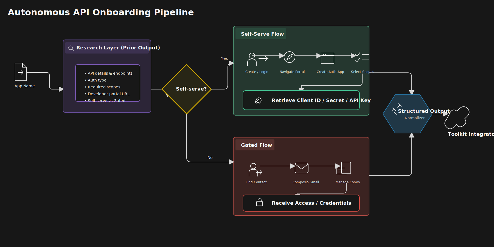

# Composio Toolkit Ops Agent

A private operations control plane for researching an app's integration requirements, choosing a self-serve or gated onboarding route, running approved provider actions, and producing a sanitized `IntegratorBundle` for downstream toolkit integration.

The stack combines a Python operations domain, durable LangGraph workflows, a token-protected FastAPI service, and a Next.js operator website. It fails closed: missing configuration is reported as `configuration_required` or `unavailable`, never as fabricated success.

## Architecture



The same asset is included in the website image at `/architecture.svg`.

1. **Research:** P1 evidence and optional configured research providers identify API endpoints, authentication, scopes, developer portals, and access route.
2. **Route:** deterministic policy selects self-serve onboarding or a gated vendor-contact flow.
3. **Self-serve:** Browser Use can navigate the portal and create an auth application when explicitly enabled.
4. **Gated:** Composio Gmail can manage controlled outreach and replies when explicitly enabled.
5. **Human gates:** CAPTCHA, OTP, passkeys, billing, approval, and other sensitive steps pause for an operator.
6. **Output:** only evidenced results become a normalized bundle. Credential material is represented publicly only by exact `vault://...` references.

## What works

| Capability | Behavior |
|---|---|
| P1 app search and research | Available offline from the pinned snapshot |
| Route planning | Available offline and deterministic |
| `plan_only` runs | Safe default; performs no browser, email, credential-validation, or other provider side effects |
| `execute_when_configured` runs | Requests configured capabilities but still obeys every provider and owner safety gate |
| Browser onboarding | Requires Browser Use configuration and `ALLOW_LIVE_BROWSER=true` |
| Vendor email | Requires Composio Gmail configuration and explicit email authorization |
| HITL resume and retry | Available from the run page when the backend state permits it |
| Encrypted vault and checkpoints | Require stable vault and LangGraph encryption keys |
| Integrator output | Returned only when the run has sufficient real evidence |
| CLI and Streamlit | Trusted local dry-run/debug surfaces, not substitutes for the website workflow |

Offline tests use fixtures or fakes. They do not prove live email delivery, vendor approval, browser completion, credential generation, or provider acceptance.

## Prerequisites

- Python `3.11`
- Node.js `22` recommended
- npm with the committed lockfile
- Docker and Docker Compose only for container deployment
- Playwright Chromium only for browser-related local development/tests

## Quick start

### 1. Install

```bash
git clone <repository-url>
cd composio-toolkit-ops-agent
python3.11 -m venv .venv
source .venv/bin/activate
python -m pip install --requirement requirements-dev.txt
python -m playwright install chromium
cd web
npm ci --no-audit --no-fund
cd ..
```

`requirements-dev.txt` includes the API, CLI, provider adapters, tests, linting, and typing tools. For a smaller installation, use `requirements.txt` for the core/API interfaces and `requirements-providers.txt` for provider adapters.

### 2. Configure

```bash
cp .env.example .env
cp web/.env.example web/.env.local
```

Create one private, random internal API token and set it as `OPS_INTERNAL_API_TOKEN` in both `.env` and `web/.env.local`. The Next.js server uses it to call FastAPI; it must never be exposed through a `NEXT_PUBLIC_*` variable.

For durable execution, also configure independent, stable values for:

- `LANGGRAPH_AES_KEY` — encrypted workflow checkpoints.
- `SECRET_VAULT_KEY` — encrypted credential storage.

Keep `.env`, `.env.production`, databases, credentials, cookies, signed URLs, and provider payloads out of Git and logs. Do not reuse encryption keys, and do not rotate them without a migration plan because existing encrypted state would become unreadable.

Provider variables can remain empty for offline planning:

| Capability | Configuration |
|---|---|
| Research enrichment | `PERPLEXITY_API_KEY`, `GOOGLE_GENAI_API_KEY` |
| Gmail outreach | `COMPOSIO_API_KEY`, `COMPOSIO_USER_ID`, `COMPOSIO_GMAIL_CONNECTED_ACCOUNT_ID` |
| Browser onboarding | `BROWSER_USE_API_KEY` |
| Company context | `COMPANY_LEGAL_NAME`, `COMPANY_WEBSITE`, `COMPANY_WORK_EMAIL_REF`, `COMPANY_USE_CASE` |

A configured key means only “configured,” not “verified” or “successful.” Check the website's provider state and run timeline for actual evidence.

### 3. Start the API and website

In terminal 1:

```bash
source .venv/bin/activate
make api
```

In terminal 2:

```bash
make web
```

Open **http://127.0.0.1:3000**. The API listens on `http://127.0.0.1:8000` but is intended to be called by trusted server-side code. If `OPS_ENABLE_API_DOCS=true`, local API docs are available at `http://127.0.0.1:8000/docs`.

## Use the website

The Next.js website is the primary operator interface.

### Create a run

1. Open **New run** at `/runs/new`.
2. Enter the app name and company profile: legal name, website, work-email vault reference, and use case.
3. Select the requested scope policy.
4. Select an execution mode:
   - **Plan only** researches and plans without external actions.
   - **Execute when configured** may invoke approved providers when all required configuration and safety flags are present.
5. Submit the form. The server creates an idempotent run and redirects to its run page.

Use **Plan only** when exploring an app or validating setup. Do not select live execution merely because provider keys exist.

### Operate a run

The page at `/runs/{run_id}` shows:

- the current status and execution mode;
- research evidence and deterministic access route;
- research, browser, HITL, email, and output phase states;
- provider configuration posture;
- owner controls that are currently authorized;
- sanitized timeline events;
- the final `IntegratorBundle` when it is genuinely ready.

When a run pauses, follow the displayed state rather than assuming success:

- **Resume** continues the same durable thread after a supported human action.
- **Live view** opens an ephemeral provider tab when a browser session and owner gate are available; it is not an embedded browser console.
- **Poll email** checks the controlled Composio Gmail thread when outreach is active.
- **Retry** reruns only the selected eligible capability.
- **Output** remains unavailable until readiness is supported by evidence.

### Other website pages

| Route | Purpose |
|---|---|
| `/` | App catalog, system summary, and recent runs |
| `/runs/new` | Create an operations run |
| `/runs/{run_id}` | Operate and inspect one run |
| `/apps/{slug}` | View evidence-backed app research |
| `/system` | Inspect snapshot, provider, and runtime health |

The browser never receives `OPS_INTERNAL_API_TOKEN`. Next.js performs protected API calls in server code. The website has no multi-user authorization model; keep local access on loopback and use the authenticated reverse proxy in production.

## API use

Every `/api/*` request requires the internal token in the `X-Ops-Internal-Token` header. Use an environment variable or secret manager reference; never paste the value into source, documentation, screenshots, or shell history.

```bash
curl --fail --silent \
  --header "X-Ops-Internal-Token: ${OPS_INTERNAL_API_TOKEN}" \
  http://127.0.0.1:8000/api/system/health
```

| Method | Path | Purpose |
|---|---|---|
| `POST` | `/api/runs` | Create an idempotent run |
| `GET` | `/api/runs` | List runs |
| `GET` | `/api/runs/{run_id}` | Read run state |
| `GET` | `/api/runs/{run_id}/timeline` | Read sanitized events |
| `POST` | `/api/runs/{run_id}/resume` | Resume an eligible HITL run |
| `GET` | `/api/runs/{run_id}/live-view` | Get an owner-gated ephemeral live view |
| `POST` | `/api/runs/{run_id}/poll-email` | Poll the controlled email thread |
| `POST` | `/api/runs/{run_id}/retry` | Retry an eligible capability |
| `GET` | `/api/runs/{run_id}/output` | Read an evidenced integrator bundle |
| `POST` | `/api/runs/{run_id}/credentials` | Submit owner-only credential material to the encrypted vault |
| `POST` | `/api/runs/{run_id}/credentials/reveal` | Loopback-only owner reveal boundary |
| `GET` | `/api/apps/search?q=` | Search apps in the P1 snapshot |
| `GET` | `/api/apps/{slug}/research` | Read app research and provenance |
| `GET` | `/api/system/health` | Read sanitized runtime health |

Credential submission and reveal additionally require `ALLOW_LOCAL_CREDENTIAL_SUBMISSION=true`; reveal remains loopback-only. Signed live-view URLs are ephemeral and must never be persisted or shared.

## CLI and Streamlit

The CLI is useful for local diagnostics and ledger inspection:

```bash
source .venv/bin/activate
python -m ops.cli --help
python -m ops.cli doctor
python -m ops.cli run "HubSpot"
python -m ops.cli status <run_id>
```

It also exposes `resume`, `poll-email`, and `show-output`, but this surface is intentionally limited and can report a phase as unavailable. Use the website for the complete API-backed operator workflow.

Start the trusted local Streamlit debugger with:

```bash
make streamlit
```

## Live-provider safety

Live actions are disabled by default. Normal tests are offline-safe. A live provider test or operation requires explicit authorization, the relevant account configuration, and all applicable safety flags.

- `RUN_LIVE_TESTS=1` permits tests marked `live`.
- `ALLOW_LIVE_BROWSER=true` permits paid/live Browser Use execution.
- `ALLOW_LIVE_VENDOR_EMAIL=true` permits vendor email; otherwise use only a controlled override.
- `ALLOW_LOCAL_CREDENTIAL_SUBMISSION=true` permits owner credential boundaries under their additional network restrictions.

Review the exact intended side effect before enabling a flag. Use controlled accounts, recipients, and non-production vendor tenants. Never present fixture results as live evidence.

## Private deployment

Production uses three containers:

```text
Internet -> Caddy (TLS + Basic Auth) -> Next.js -> FastAPI -> private SQLite volume
```

Only Caddy publishes public ports. FastAPI stays on the private Docker network, and the browser talks to Next.js rather than directly to the API.

1. Point the chosen domain's DNS record at the host.
2. Copy and fill the production template:

   ```bash
   cp .env.production.example .env.production
   ```

3. Configure `DOMAIN`, `ACME_EMAIL`, Caddy Basic Auth user/hash, a private internal API token, independent stable encryption keys, and any authorized providers.
4. Keep live-action flags disabled until each action is explicitly approved.
5. Start the stack:

   ```bash
   docker compose --env-file .env.production -f compose.prod.yaml up --detach --build
   ```

6. Open `https://<your-domain>` and authenticate with the configured gateway credentials. `/healthz` is the only unauthenticated public probe.

For a hostname, Caddy obtains and renews TLS certificates automatically. `DOMAIN=:80` is an unencrypted IP-only fallback and must not be used for real credentials or provider operations. Preserve the `ops_data` and Caddy volumes, and back them up according to your private-state policy.

For a loopback-only container preview, `docker compose up --build` publishes the web and API services only on `127.0.0.1` using the safe Compose defaults.

## Verification

Run the full offline-safe security and quality gate:

```bash
./scripts/security_gate.sh
```

Focused checks:

```bash
make test
make lint
make typecheck
make frontend-check
```

The full gate includes secret scanning, Ruff, pytest with live tests disabled, mypy, compilation, dependency audits, frontend linting, TypeScript, Vitest, and a production build.

## Security model

- Public contracts and output bundles contain credential references, not raw values.
- Provider payloads, cookies, OTP values, private keys, signed URLs, and secrets must not enter logs, checkpoints, timelines, fixtures, or browser storage.
- Run state, audit data, provider-effect idempotency, checkpoints, and the vault use separate private SQLite stores.
- CORS uses explicit origins; API docs and live actions are disabled in checked-in container defaults.
- The immutable P1 snapshot records provenance and digests under `data/p1/`.
- Provider failure or missing configuration remains visible and never becomes synthetic success.
- This is a private operator tool, not a public multi-tenant SaaS authentication boundary.

`PLAN.md` remains the implementation and security contract. `AGENTS.md`, `web/AGENTS.md`, the fixture policies, active Kiro specs, and prompt assets remain intentionally separate because they are scoped instructions or runtime inputs rather than duplicate user documentation.
