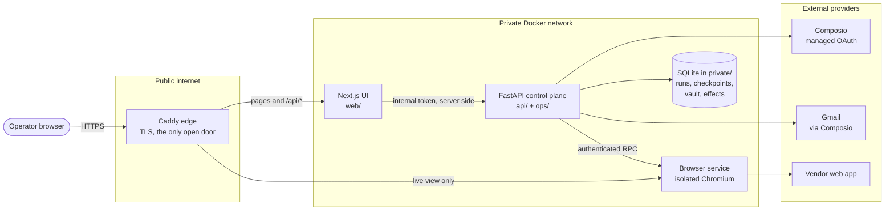
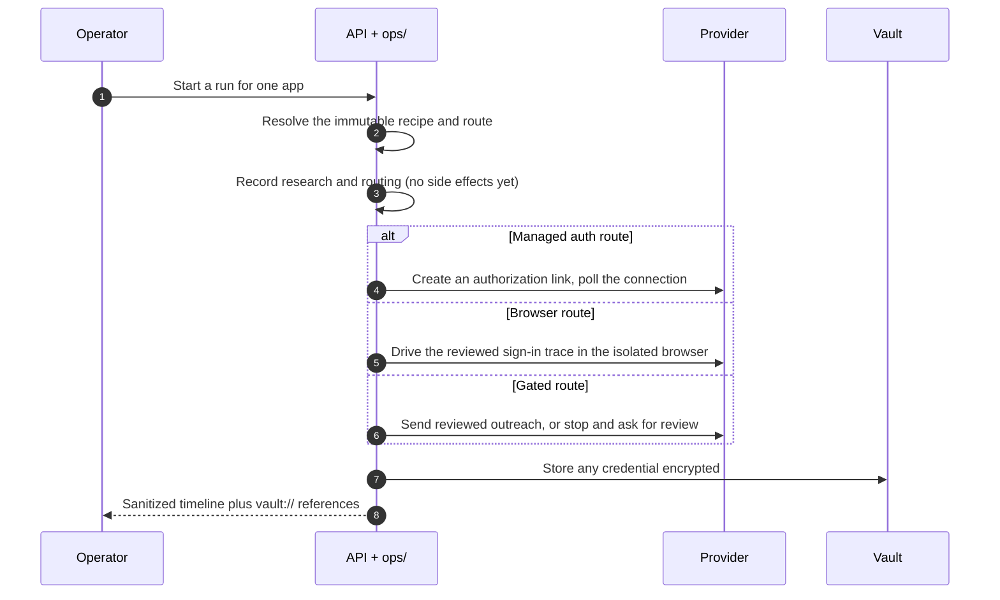

# Composio Toolkit Ops Agent

A private operator control plane for onboarding reviewed application integrations. New runs are bound to a versioned 50-app recipe catalog, execute through explicit provider boundaries, and expose only sanitized state and `vault://` credential references.

The canonical production runtime uses:

- Composio managed authentication for reviewed OAuth connections;
- an isolated Playwright browser service for reviewed browser routes;
- owner-only ordinary SQLite for canonical run state and effect receipts, plus a
  separate SQLite credential vault whose secret payloads are Fernet-encrypted;
- a FastAPI control plane behind a Next.js operator UI and Caddy.

Browser Use and You.com are not runtime providers in this rollout. Production disables both; they are not fallback paths for canonical runs.

## How the pieces fit

One operator opens the UI, picks an app, and starts a run. Everything after that
happens inside the private network. Only Caddy is reachable from the internet.


```mermaid
flowchart LR
    Operator(["Operator browser"])

    subgraph Public["Public internet"]
        Caddy["Caddy edge<br/>TLS, the only open door"]
    end

    subgraph Private["Private Docker network"]
        Web["Next.js UI<br/>web/"]
        API["FastAPI control plane<br/>api/ + ops/"]
        BrowserSvc["Browser service<br/>isolated Chromium"]
        Store[("SQLite in private/<br/>runs, checkpoints,<br/>vault, effects")]
    end

    subgraph External["External providers"]
        Composio["Composio<br/>managed OAuth"]
        Gmail["Gmail<br/>via Composio"]
        Vendor["Vendor web app"]
    end

    Operator -->|HTTPS| Caddy
    Caddy -->|"pages and /api/*"| Web
    Caddy -->|"live view only"| BrowserSvc
    Web -->|"internal token, server side"| API
    API --> Store
    API -->|"authenticated RPC"| BrowserSvc
    API --> Composio
    API --> Gmail
    BrowserSvc --> Vendor
```

Who does what:

| Piece | Job |
| --- | --- |
| **Caddy** | Terminates TLS, serves the UI, and forwards the live-view stream. Nothing else is public. |
| **Next.js UI** (`web/`) | Operator screens. It never holds provider keys; it calls the API server side with an internal token. |
| **FastAPI + `ops/`** (`api/`, `ops/`) | Decides what a run may do, records every state change, and talks to providers. |
| **Browser service** (`browser_service/`) | Runs Chromium in its own container with its own policy, so a vendor page never shares a process with the control plane. |
| **SQLite under `private/`** | Run ledger, encrypted workflow checkpoints, Fernet-encrypted credential vault, and effect receipts. Owner-only files. |

### What happens during a run


```mermaid
sequenceDiagram
    autonumber
    participant O as Operator
    participant A as API + ops/
    participant P as Provider
    participant V as Vault

    O->>A: Start a run for one app
    A->>A: Resolve the immutable recipe and route
    A->>A: Record research and routing (no side effects yet)
    alt Managed auth route
        A->>P: Create an authorization link, poll the connection
    else Browser route
        A->>P: Drive the reviewed sign-in trace in the isolated browser
    else Gated route
        A->>P: Send reviewed outreach, or stop and ask for review
    end
    A->>V: Store any credential encrypted
    A-->>O: Sanitized timeline plus vault:// references
```

Anything uncertain stops the run instead of guessing. The rules for that are in
the run model below.

## Current readiness

Catalog membership is not a claim that every app is fully autonomous or live-verified. The 50 recipes have four deliberately different capabilities:

| Capability | Apps | Current behavior |
| --- | ---: | --- |
| Managed authentication | 25 | Start a Composio authorization link, poll the connected account, and produce a reference-only bundle after Composio reports it active. |
| Complete Playwright browser flow | 1 | Pipedrive has a reviewed login-to-credential trace, automatic secret capture, read-only validation, and encrypted vault handoff. |
| Playwright entry plus owner submission | 13 | Open the reviewed public sign-in entry, then let the owner submit the independently obtained credential into the encrypted vault. These recipes do not claim credential-page navigation, automatic capture, or live validation. |
| Gated/outreach | 11 | No browser automation. Four reviewed email routes support explicit controlled-sink outreach; seven remain truthfully review-required. |

See [docs/APP_RECIPES.md](docs/APP_RECIPES.md) for the exact app matrix and promotion requirements.

## Run model

1. The app name resolves to one immutable recipe.
2. `plan_only` records research and routing without provider side effects.
3. `execute_when_configured` exposes only the action authorized by the recipe and current backend state.
4. CAPTCHA, MFA, passkeys, account selection, billing, legal consent, and ambiguous steps pause or fail closed.
5. External actions use durable effect identities so retries do not silently create duplicate work.
6. Outputs contain provider identifiers and `vault://` references, never raw credential values.

## Where the code lives

```
composio-toolkit-ops-agent/
├── api/                 FastAPI control plane: routes, request models, service wiring
├── ops/                 all business logic, grouped by domain (see below)
├── browser_service/     the isolated Chromium container's own service
├── web/                 Next.js operator UI
├── data/p1/             locked, hash-verified research snapshot
├── deploy/              Caddyfile, seccomp and AppArmor profiles
├── docker/              container entrypoints
├── docs/                app recipe matrix and operations runbook
├── scripts/             deploy, backup, restore, and security gate scripts
├── tests/               offline-by-default test suite (live tests are opt-in)
└── private/             runtime state, never committed
```

`ops/` is split by domain, so you can find a subject without reading the whole
package. Only the CLI sits at the top level.

```
ops/
├── cli.py               local operator CLI
├── core/                settings, models, run state, storage, vault, redaction
├── recipes/             the immutable 50-app catalog and its validation
├── access/              routing rules, gate policy, gated routes
├── runs/                the run boundary: create, advance, resume, project, query
├── workflow/            LangGraph graph, canonical runtime, integrator bundle
├── onboarding/          admission, phases, leases, effects, driver loop
├── browser/             browser decisions: host policy, egress, risk, sessions
├── playwright/          the Playwright driver: session, actions, gates, masking
├── credentials/         capture specs, capture boundary, validation
├── providers/           Composio boundaries and provider profiles
├── gmail/               Gmail contract, queries, validation, worker
├── email/               outreach, verification, reply classification
├── research/            operational research, baselines, cache, P1 adapter
├── you/                 You.com research provider (opt-in, off in production)
└── deploy/              deployment acceptance markers
```

Naming rule: a module drops the prefix that repeats its folder
(`browser/worker.py`, not `browser/browser_worker.py`) and keeps a prefix that
adds meaning (`workflow/graph_checkpoints.py`).

## Local startup

Prerequisites are Python 3.11, Node.js 22, and npm.

```bash
python3.11 -m venv .venv
source .venv/bin/activate
make install-dev
cp .env.example .env
cp web/.env.example web/.env.local
```

Generate one random `OPS_INTERNAL_API_TOKEN` of at least 32 characters and set
that same value in `.env` and `web/.env.local`. Keep it independent from every
browser token, and keep live-action flags disabled for planning.

Start the services in separate terminals:

```bash
source .venv/bin/activate
make api
```

```bash
make web
```

Open [http://127.0.0.1:3000](http://127.0.0.1:3000). The API listens on loopback port 8000 and requires the internal token on every `/api/` request.

For local Playwright debugging only, install Chromium and explicitly enable the in-process sandbox:

```bash
make install-browser
```

Then set `ALLOW_LIVE_BROWSER=true`, `BROWSER_PROVIDER=playwright`, and `PLAYWRIGHT_IN_PROCESS_SANDBOX=true` in the private local environment. Production never runs Chromium in the API process.

## Production startup

The production topology is defined entirely by `compose.prod.yaml`.

```bash
cp .env.production.example .env.production
sudo ./scripts/deploy-droplet.sh
```

Set these before you deploy:

- the domain and the application login, including its own Base32 TOTP secret;
- one shared internal API token;
- the stable private keys for the credential, browser-storage, and recovery boundaries;
- the browser-service token and owner;
- only the providers you actually intend to use.

Managed routes also need Composio configuration and a public HTTPS callback base.
Live Playwright also needs `ALLOW_LIVE_BROWSER=true` and at least one configured
browser-decision model.

The deploy script does the careful parts for you. It refuses a dirty worktree,
installs the browser-only AppArmor policy Chromium's sandbox needs on Ubuntu,
checks that Playwright capacity is bounded, proves the candidate browser works on
the real host before any downtime, builds the exact Git revision, waits for all
four services, verifies the running image revisions, and finally proves public
TLS and the application-auth boundary.

One host, on purpose: the stores under `private/` are SQLite, and SQLite allows
writers on a single host only. Onboarding workers therefore run on exactly one
host. Spreading workers across hosts would mean swapping in a shared store and a
shared queue, which this implementation does not include. Browser capacity still
scales inside the single host through the bounded browser pool.

Operational verification and incident commands are in [docs/OPERATIONS.md](docs/OPERATIONS.md).

## Safety boundaries

- Caddy is the only public service; FastAPI and browser RPC remain on the private Docker network.
- Every API request requires a server-only internal token.
- Public pages and server actions are protected by a signed HTTP-only application session except `/healthz` and `/login`.
- A candidate deployment can answer health and login probes, but cannot mutate a run, use the browser-secret broker, or mint a live-view grant until its exact revision-and-nonce acceptance marker exists.
- Canonical run state and effect receipts are ordinary SQLite records. Their
  boundary is owner-only filesystem and container access, not application-layer
  encryption. Credential values are encrypted separately in the Fernet vault.
- App login values never enter run state, checkpoints, audit events, screenshots,
  or model prompts. Reusable email/password pairs may be retained only in the
  encrypted account-scoped vault; OTPs and verification links remain one-time.
- Captured and owner-submitted credentials cross directly into the encrypted vault.
- Sensitive browser surfaces suppress screenshots before capture.
- Interactive browser control is granted only during a recorded human-in-the-loop pause.
- Raw credential values never cross an API response; trusted backend integrations resolve `vault://` references in process.
- Missing configuration never switches routes or providers; it produces an explicit unavailable or configuration-required state.

## Verification

```bash
make lint
make typecheck
make test
make frontend-check
make security
```

Offline tests use fakes and fixtures. They do not prove a live vendor login, provider authorization, credential validity, or production deployment. Live claims require a sanitized run timeline and host-specific deployment evidence.
